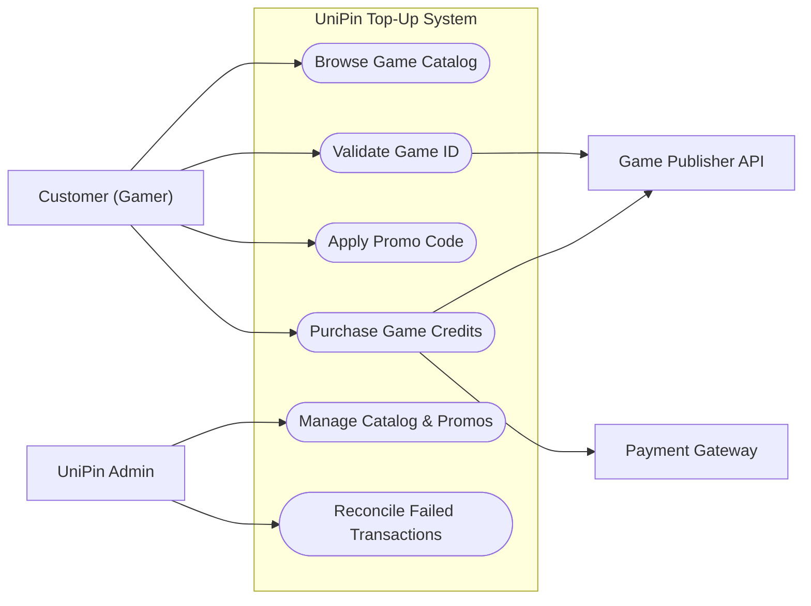
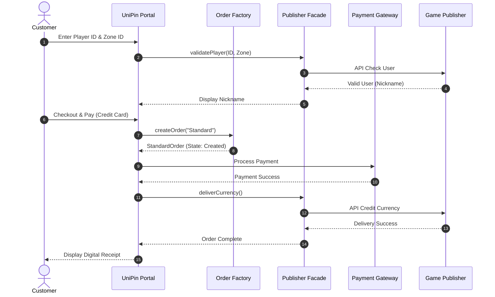
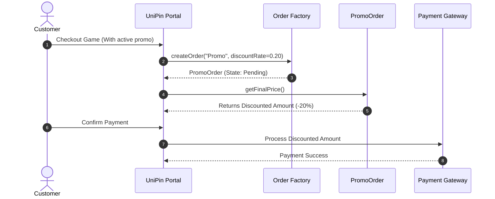
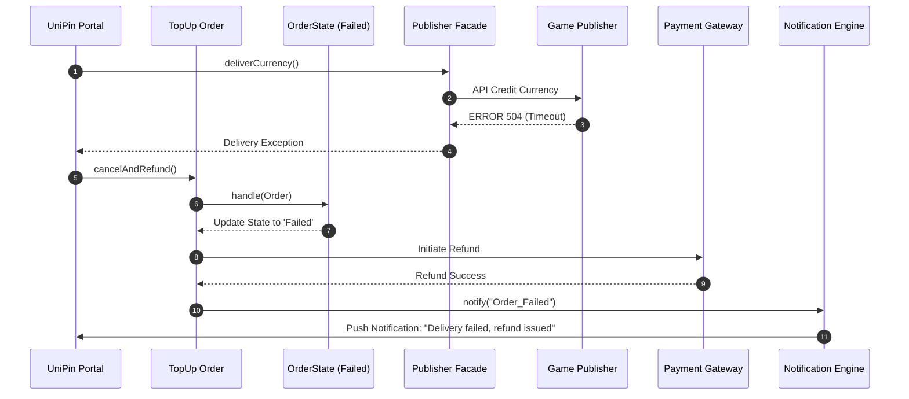
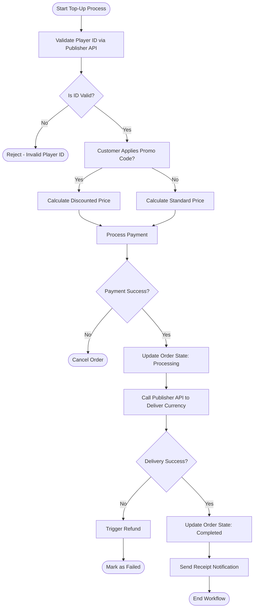
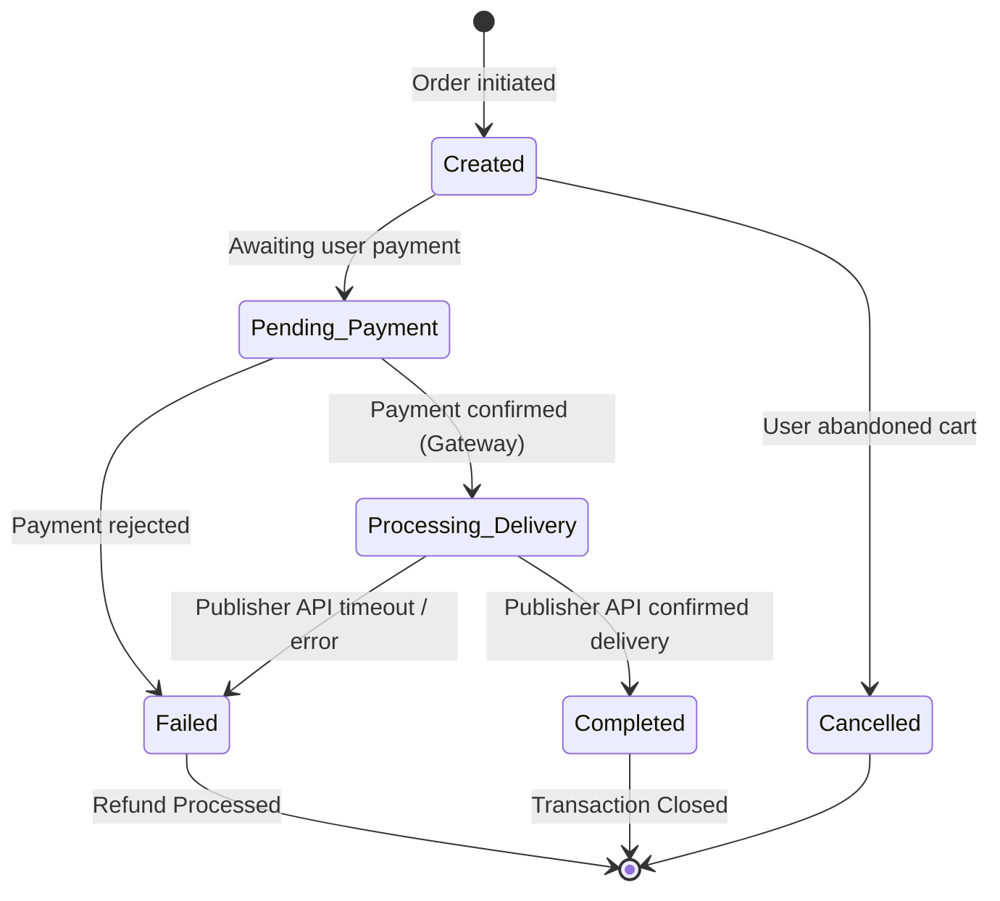
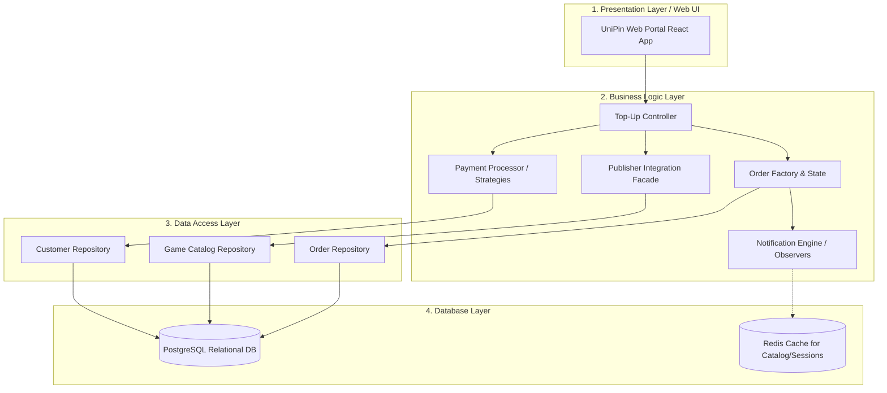

# UniPin Game-TopUp System SDD

**Members:**
- Kuy Visal
- Rous Rendo
- Kuoch Bunpor
- Ny Sihac

---

## Table Of Contents

1. [Project Overview](#1-project-overview)
2. [Project Scope](#2-project-scope)
3. [Functional Requirements & Non-Functional Requirements](#3-functional-requirements--non-functional-requirements)
4. [UML Diagrams](#4-uml-diagrams)
   - [Use Case Diagram](#41-use-case-diagram)
   - [Class Diagram](#42-class-diagram)
   - [Sequence Diagrams](#43-sequence-diagrams)
   - [Activity Diagram](#44-activity-diagram)
   - [State Diagram](#45-state-diagram)
5. [Design Pattern Application](#5-design-pattern-application)
6. [Layered Architecture](#6-layered-architecture)
7. [Document References](#7-document-references)

---

## 1. Project Overview
This project goal is to analyse and study UniPin’s Game-TopUp system. In hopes of understanding the ins and outs of it.

## 2. Project Scope
This project will be solely focusing on the TopUp system and won’t be touching their other features like their reselling program. 
The scope will include the following (In-Scope):
- User-beginner UI interface
- Mock Topup Demo with Mock Data
- Implementation With Design Pattern in mind
- Backend & Database integration

This project won’t be including the following (Out-of-Scope):
- A real MVP of the topup system
- Integration with real game-developers
- No B2B Business with resellers
- Authentication

## 3. Functional Requirements & Non-Functional Requirements

### Functional Requirements
**FR-01: In-game Account Link**
Users should be able to link with their in-game account just with their game id

**FR-02: Payment method**
Users should be able to choose a payment method. (ABA, ACELEDA, and etc)

**FR-03: Promo-codes**
Users should be able to use promo-codes alongside their purchases to get a discount.

**FR-04: Currency denomination selector**
Users should be able to select the amount of currency that they want to pay for.

**FR-05: Confirm popup before payment**
Users should confirm before payment if they’re making payment to the right account.

### Non-Functional Requirements
**NFR-01: Responsiveness**
Users should only wait at a maximum of 10s for their payment to go through.

**NFR-02: Scalability**
Should be able to handle 100 users making requests at the same time.

**NFR-03: Reliability**
Database should have an uptime of 99.67% 

**NFR-04: Reusability & Readability**
Code written should have design pattern in mind.

---

## 4. UML Diagrams

### 4.1 Use Case Diagram
**Actors:** User (Customer), UniPin Admin, Game Publisher API, Payment Gateway.
**Use Cases:** Browse Game Catalog, Validate Game ID, Purchase Game Credits, Apply Promo Code, Manage Catalog & Promos, Reconcile Transactions.

**Flow Description:**
- **User Interactions:** The User initiates the process by interacting with the Browse Game use case. Browse Game has an `<<extend>>` relationship to Select Game, showing the flow moves to game selection. Select Game has an `<<extend>>` relationship to Buy currency, indicating the user can proceed to purchase. Apply Coupon is connected to Buy currency via a `<<extend>>` and dashed line, representing an optional step during the buying process. The Buy currency use case has three mandatory `<<include>>` relationships that must be executed: Enter PlayerID, Select Denomination, Process Payment. The Enter PlayerID use case further includes (`<<include>>`) Verify Player, meaning player verification is a required part of entering the ID. The Process Payment use case includes (`<<include>>`) Generate Receipt, meaning a receipt is mandatorily created when payment is processed.
- **Game Publisher Interactions:** The Game Publisher is connected directly to three backend operations to complete the transaction lifecycle: Verify Player confirms the account is valid. Verify Payment independently checks and confirms the payment status. Deliver Goods executes the final step to send the purchased items or currency to the player.

### 4.2 Class Diagram
This class diagram illustrates the full system model, incorporating the design patterns used for payment strategies, Publisher API facades, state management, notifications, and factory creation.

```mermaid
classDiagram
    %% ── USER HIERARCHY ──────────────────────────────
    class GuestUser {
        +int userId
        +browseCatalog() void
        +validateGameId() void
    }

    class RegisteredUser {
        +int userId
        +String email
        +int loyaltyPoints
        +checkout() void
    }

    class Admin {
        +int userId
        +String email
        +String passwordHash
        +managePromotions() void
        +reconcileFailedTransactions() void
        +manageCatalog() void
    }

    %% ── GAME CATALOG & PROMOTION ────────────────────
    class GameCatalog {
        +String gameCode
        +String gameName
        +number basePrice
        +bool active
        +updatePrice() void
    }

    class GamePromotion {
        +String promoCode
        +String gameCode
        +double discountPercentage
        +bool active
        +isApplicable() bool
    }

    GuestUser "0..*" --> "8..7" GameCatalog : Browse
    GameCatalog "1" --> "0..*" GamePromotion : Offers
    GamePromotion ..> GameCatalog : apply

    %% ── ORDER — Factory + State + Template ──────────
    class OrderFactory {
        +createOrder() TopUpOrder
    }

    class TopUpOrder {
        <<abstract>>
        +String orderId
        +String playerId
        +String zoneId
        +String gameCode
        +double baseAmount
        +OrderStatus status
        +setState(newState OrderState) void
        +pay() void
        +deliver(success bool) void
        +cancelAndRefund() void
        +getFinalPrice() double
    }

    class StandardOrder {
        +getFinalPrice() double
    }

    class PromoOrder {
        +String promoCode
        +double discountPercentage
        +getFinalPrice() double
    }

    class OrderType {
        <<enumeration>>
        Standard
        Promo
    }

    class OrderStatus {
        <<enumeration>>
        Created
        PendingPayment
        ProcessingDelivery
        Completed
        Failed
    }

    TopUpOrder <|-- StandardOrder
    TopUpOrder <|-- PromoOrder
    OrderFactory ..> TopUpOrder : create as
    RegisteredUser "1" --> "0..*" TopUpOrder : Places

    %% ── STATE PATTERN ───────────────────────────────
    class OrderState {
        <<interface>>
        +getStatusString() String
        +pay(order TopUpOrder) void
        +deliver(order TopUpOrder, success bool) void
    }

    class PendingState {
        +getStatusString() String
        +pay(order TopUpOrder) void
        +deliver(order TopUpOrder, success bool) void
    }

    class CompletedState {
        +getStatusString() String
        +pay(order TopUpOrder) void
        +deliver(order TopUpOrder, success bool) void
    }

    class FailedState {
        +getStatusString() String
        +pay(order TopUpOrder) void
        +deliver(order TopUpOrder, success bool) void
    }

    OrderState <|.. PendingState
    OrderState <|.. CompletedState
    OrderState <|.. FailedState
    TopUpOrder "1" --> "1" OrderState

    %% ── PAYMENT — Strategy Pattern ──────────────────
    class PaymentProcessor {
        <<Service>>
        +strategy PaymentStrategy
        +setStrategy(strategy paymentMethod) void
        +processPayment(amount) bool
        +refund(orderId String, amount double) bool
    }

    class PaymentStrategy {
        <<interface>>
        +pay(amount) bool
        +getName() String
    }

    class CreditCardStrategy {
        +pay(amount) bool
        +getName() String
    }

    class BankTransferStrategy {
        +pay(amount) bool
        +getName() String
    }

    class PaymentGateway {
        <<interface>>
        +charge(orderId, amount, method) void
        +refund(orderId, amount) void
    }

    class PaymentMethod {
        <<enumeration>>
        Creditcard
        BankTransfer
    }

    PaymentStrategy <|.. CreditCardStrategy
    PaymentStrategy <|.. BankTransferStrategy
    PaymentProcessor "1" --> "1" PaymentStrategy : choose
    PaymentProcessor ..> PaymentGateway : pay/refund
    TopUpOrder "1" --> "1" PaymentProcessor : has

    %% ── DELIVERY — Adapter & Facade Pattern ─────────
    class PublisherFacade {
        +validatePlayer(gameCode, PlayerId, zoneId) void
        +deliverCurrency(gameCode, playerId, amount, zoned) void
    }

    class GamePublisherAPI {
        <<interface>>
        +getServerList(gameCode) void
        +verify(playerId, zoneID) void
        +checkout(orderId, amount) void
        +deliver(orderId, amount) void
    }

    class MoontonAdapter {
        -moontonSDK MoontonLegacySystem
        +getServerList(gameCode) void
        +verify(playerId, zoneID) void
        +checkout(orderId, amount) void
        +deliver(orderId, amount) void
    }

    class TencentAdapter {
        -tencentSDK TencentRestAPI
        +getServerList(gameCode) void
        +verify(playerId, zoneID) void
        +checkout(orderId, amount) void
        +deliver(orderId, amount) void
    }

    class MoontonLegacySystem {
        <<Third-Party>>
        +checkAccountValid(accId, serverId)
        +addDiamonds(txId, accId, serverId, count)
    }

    class TencentRestAPI {
        <<Third-Party>>
        +validateSession(openId)
        +grantGameCurrency(orderId, openId, amount)
    }

    GamePublisherAPI <|.. MoontonAdapter
    GamePublisherAPI <|.. TencentAdapter
    MoontonAdapter --> MoontonLegacySystem : adapts
    TencentAdapter --> TencentRestAPI : adapts

    TopUpOrder ..> PublisherFacade : validate/deliver
    PublisherFacade ..> GamePublisherAPI : routes to specific adapter
```

### 4.3 Sequence Diagrams

#### Sequence 1: Direct Purchase Flow (Standard Order)
*A Customer selects a game, validates their ID, and pays via a payment gateway. UniPin delivers the goods.*

#### Sequence 2: Apply Promotion & Checkout
*A Customer selects a Game that has an active promotion. The system automatically creates a `PromoOrder` which calculates a discounted final price.*

#### Sequence 3: Payment Failure & Auto-Refund
*A game publisher's API times out during delivery. UniPin transitions the order to Failed and issues a refund.*

**Flow Description:**
1. **Game Selection Phase:** The User initiates the process by sending a Select Game action to UniPin. UniPin requests server information from the Game Publisher. The Game Publisher replies to UniPin providing the server details. UniPin processes this and uses it to show the game page to the User.
2. **User Verification Phase:** The User proceeds to input user details and select payment method on the UniPin interface. UniPin sends a Verify request to the Game Publisher to validate the provided user details against the game's database. UniPin successfully validates the account and loads the game username to display the confirmed player name back to the User.
3. **Checkout Phase:** The User initiates the final purchase by sending a confirm checkout command. UniPin forwards a checkout request to the Game Publisher to prepare the transaction. The Game Publisher returns a transaction ID to track the purchase. UniPin then transitions the User to the payment page.
4. **Payment & Delivery Phase:** The User executes the Complete Payment action. Upon successful payment, UniPin sends a Delivery command to the Game Publisher to fulfill the order. The Game Publisher executes DeliverGoods directly to the User's in-game account. Simultaneously, the Game Publisher sends a DeliveryResponse status back to UniPin to confirm whether the delivery was successful. Finally, UniPin communicates this final result to the User.

### 4.4 Activity Diagram
*The complete logic workflow for processing a top-up request to completion.*

**Flow Description:**
- **Start:** The process is initiated.
- **Browse Game:** The user browses for a game. If the game doesn't exist, loop back.
- **Select Game & Input PlayerID:** The user selects the confirmed game and inputs their specific player ID. If the player is not found, loop back.
- **Display Username:** The system successfully retrieves and displays the username associated with the player ID.
- **Select Denomination & Payment Method:** The user chooses the amount and is prompted to pick between credit card, debit card, and E-wallet.
- **Make Payment:** The user initiates the payment process. If there are insufficient funds, the state loops back. If successful, it proceeds.
- **Show Delivery Status & Generate Receipt:** The system displays the delivery status, generates a receipt for the completed transaction.
- **End:** The activity flow terminates.

### 4.5 State Diagram
*State machine for the Order lifecycle.*

---

## 5. Design Pattern Application

We have applied 5 design patterns to solve specific architectural problems in the UniPin System.

| Pattern | Category | Problem Solved | Location in Class Diagram | Why Chosen |
| :--- | :--- | :--- | :--- | :--- |
| **1. Facade Pattern** | Structural | UniPin connects to dozens of different Game Publishers (Moonton, Tencent), all with entirely different APIs. The core system shouldn't know these details. | `PublisherFacade` class. It shields the `TopUpOrder` from the complexity of external APIs. | Chosen over direct API calls in the Order class to ensure loose coupling. When a new game is added, we only update the Facade. |
| **2. Adapter Pattern** | Structural | Third-party game publishers (e.g., Moonton, Tencent) have incompatible, proprietary APIs. We need a unified way to communicate with them. | `MoontonAdapter`, `TencentAdapter` implementing `GamePublisherAPI`. | Chosen to map our internal `GamePublisherAPI` interface to the incompatible methods of `MoontonLegacySystem`. It isolates data translation logic. |
| **3. Strategy Pattern** | Behavioral | Top-ups can be paid for via Credit Cards, E-Wallets, or Bank Transfers. Writing `if/else` for every payment method makes checkout rigid. | `PaymentProcessor` uses the `PaymentStrategy` interface. | Chosen over inheritance because payment methods are interchangeable behaviors at runtime. It perfectly adheres to the Open/Closed Principle. |
| **4. State Pattern** | Behavioral | Orders have a strict lifecycle. State transitions require complex validation. | `OrderState` interface and concrete state classes. | Chosen over massive switch statements inside the `TopUpOrder` class. Each state handles its own transition logic securely. |
| **5. Factory Method** | Creational | We have distinct types of checkout flows: Standard purchases and Promotional purchases which require different price calculations. | `OrderFactory` class with `createOrder()` which produces a `TopUpOrder` subclass. | Chosen to centralize the complex creation logic and cleanly separate standard pricing from promotional pricing. |

---

## 6. Layered Architecture

The system employs a strict 4-Tier Layered Architecture separating concerns from user interaction down to data storage.

### Layer Mapping Details:
1. **Presentation Layer:** Contains UI views for Customers. Maps to the **Actors** in the Use Case Diagram.
2. **Business Logic Layer:** Where the core algorithms and Design Patterns live. Maps directly to `PaymentProcessor`, `PublisherFacade`, `OrderFactory`, `OrderState`, and `NotificationEngine` from the Class Diagram.
3. **Data Access Layer:** Utilizes the Repository pattern to decouple SQL queries from business logic. Translates business objects into database records.
4. **Database Layer:** The raw storage engines maintaining ACID compliance for Customer data and Order states.

---

## 7. Document References
- UniPin developer documents (Game-Top Up v1) https://developer-docs.unipin.com/#top-up
