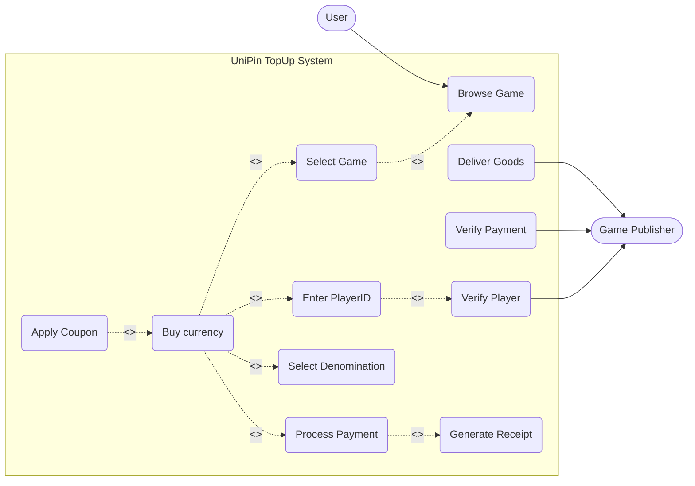
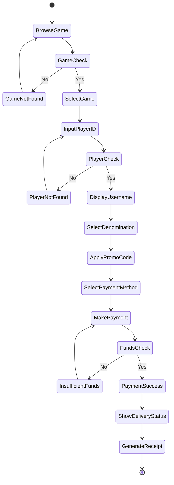
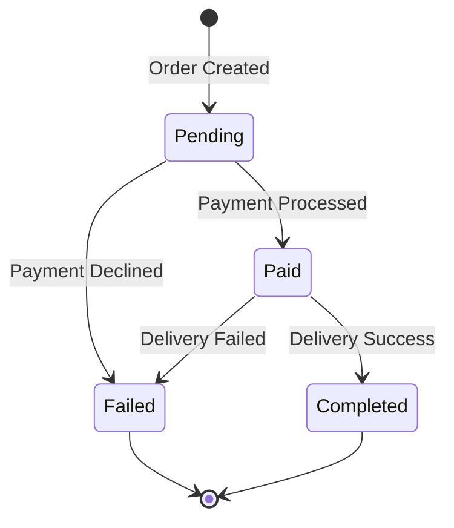
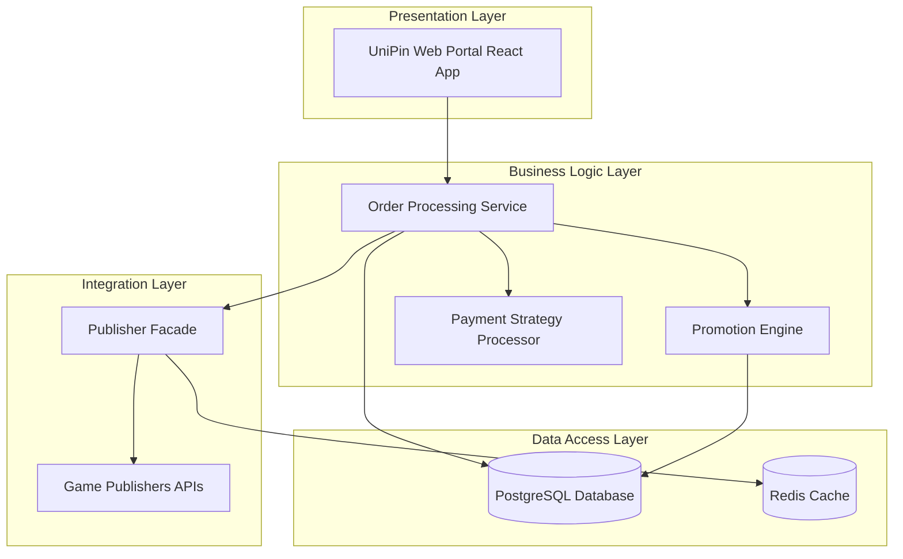

# UniPin Game-TopUp System SDD

**Members:** 
- Kuy Visal
- Rous Rendo
- Kuoch Bunpor
- Ny Sihac

## Table Of Contents

- [Project Overview](#project-overview)
- [Project Scope](#project-scope)
- [Functional Requirements & Non-Functional Requirements](#functional-requirements--non-functional-requirements)
- [UML Diagrams](#uml-diagrams)
  - [Use-Case Diagram](#use-case-diagram)
  - [Class Diagram](#class-diagram)
  - [Sequence Diagram](#sequence-diagram)
  - [Activity Diagram](#activity-diagram)
  - [State Diagram](#state-diagram)
- [Design Patterns](#design-patterns)
  - [Creational](#creational)
  - [Structural](#structural)
  - [Behavioral](#behavioral)
- [Layered Architecture](#layered-architecture)
- [Document References](#document-references)

---

## Project Overview
This project goal is to analyse and study UniPin’s Game-TopUp system. In hopes of understanding the ins and outs of it.

## Project Scope
This project will be solely focusing on the TopUp system and won’t be touching their other features like their reselling program. 

**The scope will include the following (In-Scope):**
- User-beginner UI interface
- Mock Topup Demo with Mock Data
- Implementation With Design Pattern in mind
- Backend & Database integration

**This project won’t be including the following (Out-of-Scope):**
- A real MVP of the topup system
- Integration with real game-developers
- No B2B Business with resellers
- Authentication

---

## Functional Requirements & Non-Functional Requirements

### Functional Requirements
- **FR-01 In-game Account Link:** Users should be able to link with their in-game account just with their game id
- **FR-02 Payment method:** Users should be able to choose a payment method. (ABA, ACLEDA, and etc)
- **FR-03 Promo-codes:** Users should be able to use promo-codes alongside their purchases to get a discount.
- **FR-04 Currency denomination selector:** Users should be able to select the amount of currency that they want to pay for.
- **FR-05 Confirm popup before payment:** Users should confirm before payment if they’re making payment to the right account.

### Non-Functional Requirements
- **NFR-01 Responsiveness:** Users should only wait at a maximum of 10s for their payment to go through.
- **NFR-02 Scalability:** Should be able to handle 100 users making requests at the same time.
- **NFR-03 Reliability:** Database should have an uptime of 99.67% 
- **NFR-04 Reusability & Readability:** Code written should have design pattern in mind.

---

## UML Diagrams

### Use-Case Diagram

**Actors**
- **User:** The primary actor on the left who interacts with the system interface to browse and purchase game currency.
- **Game Publisher:** The secondary actor on the right who handles backend verification and fulfillment processes.

**Use Cases and Relationships**
- **User Interactions:**
  - The User initiates the process by interacting with the Browse Game use case.
  - Browse Game has an `<<extend>>` relationship to Select Game, showing the flow moves to game selection.
  - Select Game has an `<<extend>>` relationship to Buy currency, indicating the user can proceed to purchase.
  - Apply Coupon is connected to Buy currency via a `<<extend>>` and dashed line, representing an optional step during the buying process.
  - The Buy currency use case has three mandatory `<<include>>` relationships that must be executed:
    - Enter PlayerID
    - Select Denomination (Package)
    - Process Payment
  - The Enter PlayerID use case further includes (`<<include>>`) Verify Player, meaning player verification is a required part of entering the ID.
  - The Process Payment use case includes (`<<include>>`) Generate Receipt, meaning a receipt is mandatorily created when payment is processed.
- **Game Publisher Interactions:** The Game Publisher is connected directly to three backend operations to complete the transaction lifecycle:
  - Verify Player: Connects to this use case (which was triggered by the user) to confirm the account is valid.
  - Verify Payment: Independently checks and confirms the payment status.
  - Deliver Goods: Executes the final step to send the purchased items or currency to the player.

### Class Diagram

```mermaid
classDiagram
    %% ── USER TYPES ────────────────────────────────
    class GuestUser {
        +String ipAddress
        +String sessionToken
        +browseGames() void
        +checkout() void
    }

    class RegisteredUser {
        +int userId
        +String email
        +int loyaltyPoints
        +checkout() void
    }

    %% ── CREATIONAL: SINGLETON PATTERN ────────────
    class GameCatalog {
        -GameCatalog instance
        -List gameData
        -GameCatalog()
        +getInstance() GameCatalog
        +getAllGames() List
        +getGameById(id String) Game
    }

    class Game {
        +String gameCode
        +String name
        +String publisher
    }

    class Package {
        +String packageId
        +number amount
        +number price
    }
    
    class PromoCode {
        +String code
        +number discountPercentage
        +isValid() boolean
    }

    GameCatalog "1" *-- "0..*" Game : manages
    Game "1" *-- "0..*" Package : contains
    GuestUser "0..*" --> "1" GameCatalog : Browse
    RegisteredUser "0..*" --> "1" GameCatalog : Browse
    TopUpOrder "0..1" --> "1" PromoCode : applies

    %% ── CREATIONAL: BUILDER PATTERN ──────────
    class OrderBuilder {
        -TopUpOrder order
        +OrderBuilder()
        +setGameCode(gameCode String) OrderBuilder
        +setPlayer(playerId String, zoneId String) OrderBuilder
        +setPackage(packageId String, amount number, price number) OrderBuilder
        +applyPromoCode(code String) OrderBuilder
        +build() TopUpOrder
    }

    class TopUpOrder {
        +String orderId
        +String playerId
        +String zoneId
        +String packageId
        +String gameCode
        +double amount
        +double finalPrice
        +OrderStatus status
        +setState(newState OrderState) void
        +pay() void
        +deliver(success bool) void
        +getFinalPrice() double
    }

    class Transaction {
        +String transactionId
        +String paymentMethod
        +double amount
        +Date timestamp
        +String status
    }

    OrderBuilder ..> TopUpOrder : constructs
    TopUpOrder "1" *-- "0..*" Transaction : logs

    %% ── BEHAVIORAL: STATE PATTERN ───────────────────────────────
    class OrderState {
        <<interface>>
        +getStatusString() String
        +pay(order TopUpOrder) void
        +deliver(order TopUpOrder, success bool) void
    }

    class PendingState {
        +pay(order TopUpOrder) void
    }

    class PaidState {
        +deliver(order TopUpOrder, success bool) void
    }

    class CompletedState {
        +deliver(order TopUpOrder, success bool) void
    }

    class FailedState {
        +pay(order TopUpOrder) void
    }

    OrderState <|.. PendingState
    OrderState <|.. PaidState
    OrderState <|.. CompletedState
    OrderState <|.. FailedState
    TopUpOrder "1" --> "1" OrderState : manages state

    %% ── CREATIONAL: ABSTRACT FACTORY PATTERN ──────────
    class PaymentGatewayFactory {
        <<interface>>
        +createPaymentHandler() PaymentStrategy
        +createReceiptGenerator() ReceiptGenerator
    }

    class ABAPayFactory {
        +createPaymentHandler() PaymentStrategy
        +createReceiptGenerator() ReceiptGenerator
    }

    class ACLEDAPayFactory {
        +createPaymentHandler() PaymentStrategy
        +createReceiptGenerator() ReceiptGenerator
    }

    PaymentGatewayFactory <|.. ABAPayFactory
    PaymentGatewayFactory <|.. ACLEDAPayFactory

    %% ── BEHAVIORAL: STRATEGY PATTERN ──────────────────
    class PaymentProcessor {
        -strategy PaymentStrategy
        +setStrategy(strategy PaymentStrategy) void
        +processPayment(amount double) void
    }

    class PaymentStrategy {
        <<interface>>
        +pay(amount double) void
        +refund(amount double) void
    }

    class ABAPayStrategy {
        +pay(amount double) void
    }

    class ACLEDAPayStrategy {
        +pay(amount double) void
    }

    PaymentStrategy <|.. ABAPayStrategy
    PaymentStrategy <|.. ACLEDAPayStrategy
    PaymentProcessor "1" --> "1" PaymentStrategy : uses strategy
    TopUpOrder "1" --> "1" PaymentProcessor : utilizes
    ABAPayFactory ..> ABAPayStrategy : produces
    ACLEDAPayFactory ..> ACLEDAPayStrategy : produces

    %% ── STRUCTURAL: FACADE PATTERN ─────────
    class PublisherFacade {
        +validatePlayer(gameCode, PlayerId, zoneId) void
        +deliverCurrency(gameCode, playerId, amount, zoned) void
    }

    class GamePublisherAPI {
        <<interface>>
        +getServerList(gameCode) void
        +verify(playerId, zoneID) void
        +checkout(orderId, amount) void
        +deliver(orderId, amount) void
    }

    TopUpOrder ..> PublisherFacade : validate & deliver
    PublisherFacade ..> GamePublisherAPI : connects to
```

### Sequence Diagram

**Flow:**
1. **Game Selection Phase**
   - The User initiates the process by sending a Select Game action to UniPin.
   - UniPin requests server information from the Game Publisher using GetServerList().
   - The Game Publisher replies to UniPin with a SeverListResponse, providing the server_id and server_name.
   - UniPin processes this and uses it to Show game page to the User.
2. **User Verification Phase**
   - The User proceeds to Input user details and Select payment method on the UniPin interface.
   - UniPin sends a Verify() request to the Game Publisher to validate the provided user details against the game's database.
   - The Game Publisher sends back a UserVerificationResponse (which, according to the diagram, returns server_id, server_name).
   - UniPin successfully validates the account and triggers Load game username/nickname to display the confirmed player name back to the User.
3. **Checkout Phase**
   - The User initiates the final purchase by sending a Confirm checkout command to UniPin.
   - UniPin forwards a Checkout() request to the Game Publisher to prepare the transaction on their end.
   - The Game Publisher acknowledges this by returning a CheckoutResponse, which includes a providerTxn_id (transaction ID) to track the purchase.
   - UniPin then transitions the User to the next step via Show payment page.
4. **Payment & Delivery Phase**
   - The User executes the Complete Payment action with UniPin.
   - Upon successful payment, UniPin sends a Delivery() command to the Game Publisher to fulfill the order.
   - The Game Publisher executes DeliverGoods() directly to the User (representing the in-game delivery of the purchased currency or items to the player's account).
   - Simultaneously, the Game Publisher sends a DeliveryResponse(status) back to UniPin to confirm whether the delivery was successful.
   - Finally, UniPin communicates this final result to the User via Show delivery status.

```mermaid
sequenceDiagram
    autonumber
    actor User
    participant UniPin as UniPin System
    participant Publisher as Game Publisher

    %% Game Selection Phase
    rect rgb(30, 41, 59)
    User->>UniPin: Select Game
    UniPin->>Publisher: GetServerList()
    Publisher-->>UniPin: SeverListResponse(server_id, server_name)
    UniPin-->>User: Show game page
    end

    %% User Verification Phase
    rect rgb(30, 41, 59)
    User->>UniPin: Input user details & Select payment method
    UniPin->>Publisher: Verify(playerId, zoneId)
    Publisher-->>UniPin: UserVerificationResponse(isValid, username)
    UniPin-->>User: Load game username/nickname
    end

    %% Checkout Phase
    rect rgb(30, 41, 59)
    User->>UniPin: Confirm checkout (with promo)
    UniPin->>Publisher: Checkout()
    Publisher-->>UniPin: CheckoutResponse(providerTxn_id)
    UniPin-->>User: Show payment page
    end

    %% Payment & Delivery Phase
    rect rgb(30, 41, 59)
    User->>UniPin: Complete Payment
    UniPin->>Publisher: Delivery()
    Publisher->>User: DeliverGoods()
    Publisher-->>UniPin: DeliveryResponse(status)
    UniPin-->>User: Show delivery status
    end
```

### Activity Diagram

**Flow:**
- Start: The process is initiated.
- Browse Game: The user browses for a game.
- Condition - Does the game exist in the database?
  - If no: The state moves to "Game not found" and loops the user back to the "Browse Game" step.
  - If yes: The process continues.
- Select Game: The user selects the confirmed game.
- Input playerID: The user inputs their specific player ID for that game.
- Condition - Does the player exist in the game?
  - If no: The state moves to "Player not found" and loops the user back to the "Input playerID" step.
  - If yes: The process continues.
- Display username: The system successfully retrieves and displays the username associated with the player ID.
- Select Denomination: The user chooses the amount or specific item they wish to purchase.
- Apply Promo Code (Optional): The user enters a promo code to get a discount.
- Select payment method: user will be prompted to pick between credit card, debit card, and E-wallet.
- Make payment: The user initiates the payment process.
- Condition - Sufficient funds?
  - If no: The state moves to "Insufficient Funds" and loops the user back to the "Make payment" step to try again or use a different method.
  - If yes: The payment succeeds, and the process continues.
- Show delivery status: The system displays the status of the item or currency being delivered to the player's account.
- Generate receipt: The system generates a final receipt for the completed transaction.
- End: The activity flow terminates.

### State Diagram

---

## Design Patterns

We have applied 6 design patterns to solve specific architectural problems in the UniPin System.

### Creational
| Pattern | Problem Solved | Location in Class Diagram |
| :--- | :--- | :--- |
| **Singleton Pattern** | Centralized management of games and packages (the source of truth where Admin applies package discounts) so only a single instance of the catalog is loaded globally. | `GameCatalog` class with `getInstance()`. |
| **Builder Pattern** | A `TopUpOrder` requires setting multiple complex fields (playerId, zoneId, package details). Builder helps construct the order step-by-step cleanly. | `OrderBuilder` class with methods like `setPlayer()`, `setPackage()`, and `build()`. |
| **Abstract Factory** | Creating consistent families of payment objects (strategies and receipts). We need `ABAPayFactory` or `ACLEDAPayFactory` to produce matching handlers and receipts for their specific ecosystems. | `PaymentGatewayFactory` interface and its implementations. |

### Structural
| Pattern | Problem Solved | Location in Class Diagram |
| :--- | :--- | :--- |
| **Facade Pattern** | UniPin connects to dozens of different Game Publishers (Moonton, Tencent), all with entirely different APIs. The core system shouldn't know these details. | `PublisherFacade` class. It shields the `TopUpOrder` from the complexity of external APIs. |

### Behavioral
| Pattern | Problem Solved | Location in Class Diagram |
| :--- | :--- | :--- |
| **Strategy Pattern** | Top-ups can be paid for via Credit Cards, E-Wallets, or Bank Transfers. Writing `if/else` for every payment method makes checkout rigid. | `PaymentProcessor` uses the `PaymentStrategy` interface. |
| **State Pattern** | Orders have a strict lifecycle. State transitions require complex validation. | `OrderState` interface and concrete state classes (`PendingState`, `PaidState`, `CompletedState`, `FailedState`). |

---

## Layered Architecture

## Document References
- UniPin developer documents (Game-Top Up v1) https://developer-docs.unipin.com/#top-up
