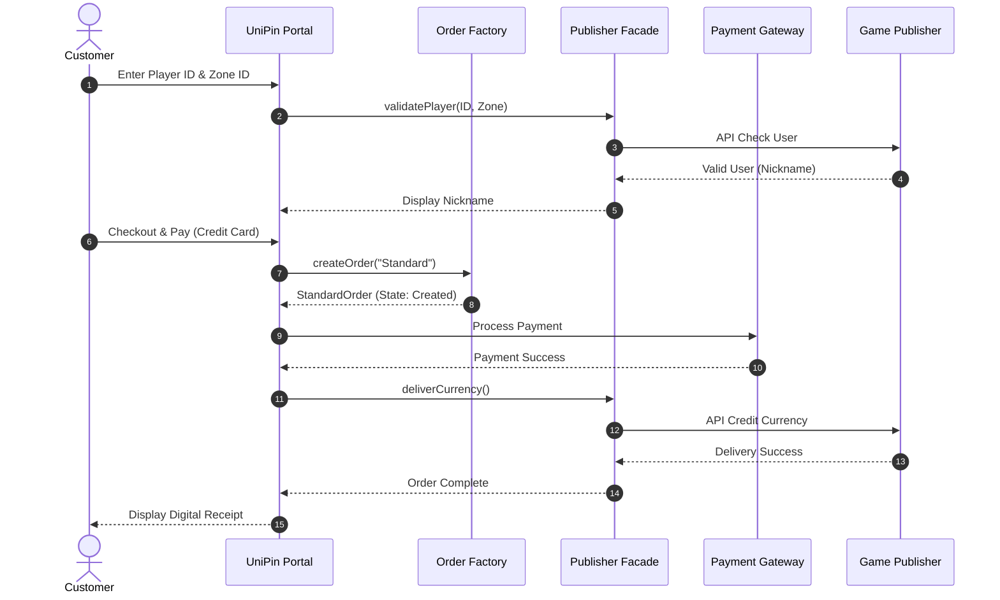
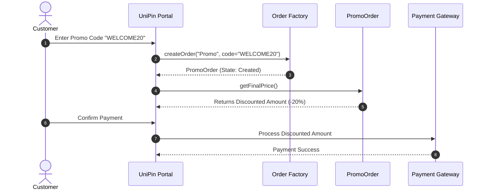
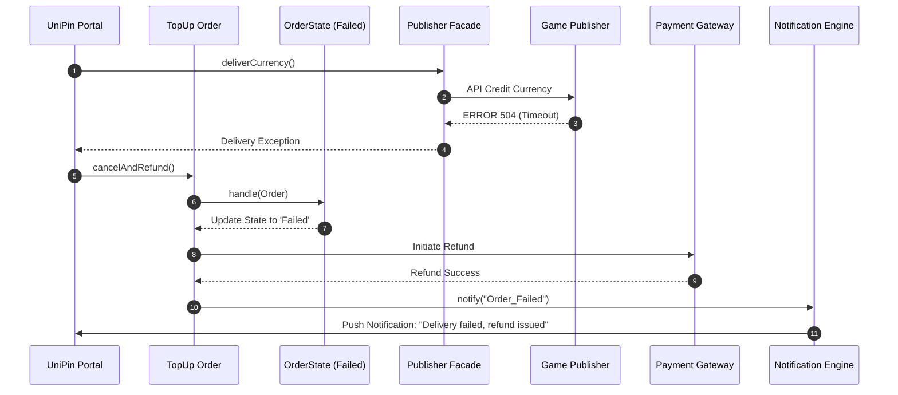
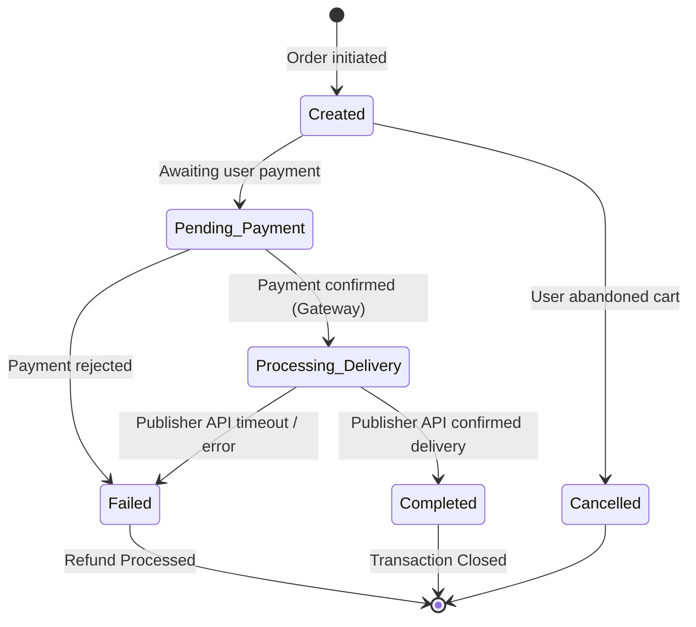
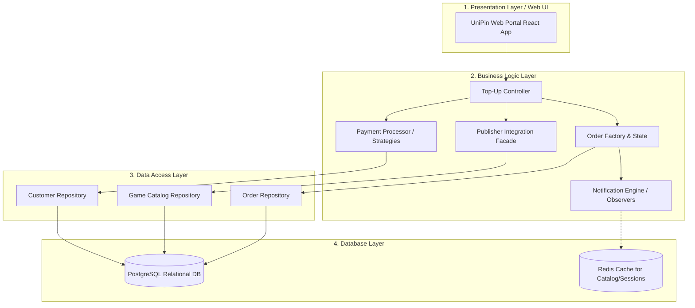

# FESE306 – Software Modeling & Design
## Final Project: Software Design Document (SDD)
**Project Name:** UniPin Game Top-Up System
**Team Members:** Kuy Visal, Kouch Bunpor, Ny Sihac, Rous Rendo
**Instructor:** Pen Voneat

---

## 1. Project Scenario & Overview

The **UniPin Game Top-Up System** acts as a centralized digital goods aggregator bridging Gamers, Payment Gateways, and Game Publishers.
- **Customers (Gamers)** browse catalogs, validate their game IDs, apply promotional discounts, and purchase in-game currency directly through the UniPin web portal.
- **UniPin System Admin** manages the game catalog, updates pricing, and creates promotional campaigns.
- The system handles real-time validation of Game IDs, processes payments through multiple channels (e.g., Credit Card, E-Wallets, Bank Transfers), and instantly fulfills orders via integrations with external **Game Publishers** (like Moonton, Tencent).
- The system includes robust failure handling, automatically rolling back and refunding transactions if a Game Publisher API times out.

---

## 2. UML Diagrams — Full Suite

### 2.1 Use Case Diagram
**Actors:** Customer (Gamer), UniPin Admin, Game Publisher API, Payment Gateway.
**Use Cases:** Browse Game Catalog, Validate Game ID, Purchase Game Credits, Apply Promo Code, Manage Catalog & Promos, Reconcile Transactions.

### 2.2 Class Diagram
This class diagram illustrates the full system model, incorporating the design patterns used for payment strategies, Publisher API facades, state management, notifications, and factory creation.

```mermaid
classDiagram
    %% ── USER HIERARCHY ──────────────────────────────
    class GuestUser {
        +int userId
        +browseCatalog() void
        +validateGameId() void
    }

    class RegisteredUser {
        +int userId
        +String email
        +int loyaltyPoints
        +checkout() void
    }

    class Admin {
        +int userId
        +String email
        +String passwordHash
        +managePromotions() void
        +reconcileFailedTransactions() void
        +manageCatalog() void
    }

    %% ── GAME CATALOG & PROMOTION ────────────────────
    class GameCatalog {
        +String gameCode
        +String gameName
        +number basePrice
        +bool active
        +updatePrice() void
    }

    class GamePromotion {
        +String promoCode
        +String gameCode
        +double discountPercentage
        +bool active
        +isApplicable() bool
    }

    GuestUser "0..*" --> "8..7" GameCatalog : Browse
    GameCatalog "1" --> "0..*" GamePromotion : Offers
    GamePromotion ..> GameCatalog : apply

    %% ── ORDER — Factory + State + Template ──────────
    class OrderFactory {
        +createOrder() TopUpOrder
    }

    class TopUpOrder {
        <<abstract>>
        +String orderId
        +String playerId
        +String zoneId
        +String gameCode
        +double baseAmount
        +OrderStatus status
        +setState(newState OrderState) void
        +pay() void
        +deliver(success bool) void
        +cancelAndRefund() void
        +getFinalPrice() double
    }

    class StandardOrder {
        +getFinalPrice() double
    }

    class PromoOrder {
        +String promoCode
        +double discountPercentage
        +getFinalPrice() double
    }

    class OrderType {
        <<enumeration>>
        Standard
        Promo
    }

    class OrderStatus {
        <<enumeration>>
        Created
        PendingPayment
        ProcessingDelivery
        Completed
        Failed
    }

    TopUpOrder <|-- StandardOrder
    TopUpOrder <|-- PromoOrder
    OrderFactory ..> TopUpOrder : create as
    RegisteredUser "1" --> "0..*" TopUpOrder : Places

    %% ── STATE PATTERN ───────────────────────────────
    class OrderState {
        <<interface>>
        +getStatusString() String
        +pay(order TopUpOrder) void
        +deliver(order TopUpOrder, success bool) void
    }

    class CreatedState {
        +getStatusString() String
        +pay(order TopUpOrder) void
        +deliver(order TopUpOrder, success bool) void
    }

    class ProcessingDeliveryState {
        +getStatusString() String
        +pay(order TopUpOrder) void
        +deliver(order TopUpOrder, success bool) void
    }

    class CompletedState {
        +getStatusString() String
        +pay(order TopUpOrder) void
        +deliver(order TopUpOrder, success bool) void
    }

    class FailedState {
        +getStatusString() String
        +pay(order TopUpOrder) void
        +deliver(order TopUpOrder, success bool) void
    }

    OrderState <|.. CreatedState
    OrderState <|.. ProcessingDeliveryState
    OrderState <|.. CompletedState
    OrderState <|.. FailedState
    TopUpOrder "1" --> "1" OrderState

    %% ── PAYMENT — Strategy Pattern ──────────────────
    class PaymentProcessor {
        <<Service>>
        +strategy PaymentStrategy
        +setStrategy(strategy paymentMethod) void
        +processPayment(amount) bool
        +refund(orderId String, amount double) bool
    }

    class PaymentStrategy {
        <<interface>>
        +pay(amount) bool
        +getName() String
    }

    class CreditCardStrategy {
        +pay(amount) bool
        +getName() String
    }

    class BankTransferStrategy {
        +pay(amount) bool
        +getName() String
    }

    class PaymentGateway {
        <<interface>>
        +charge(orderId, amount, method) void
        +refund(orderId, amount) void
    }

    class PaymentMethod {
        <<enumeration>>
        Creditcard
        BankTransfer
    }

    PaymentStrategy <|.. CreditCardStrategy
    PaymentStrategy <|.. BankTransferStrategy
    PaymentProcessor "1" --> "1" PaymentStrategy : choose
    PaymentProcessor ..> PaymentGateway : pay/refund
    TopUpOrder "1" --> "1" PaymentProcessor : has

    %% ── DELIVERY — Facade Pattern ───────────────────
    class PublisherFacade {
        +validatePlayer(gameCode, PlayerId, zoneId) void
        +deliverCurrency(gameCode, playerId, amount, zoned) void
    }

    class GamePublisherAPI {
        <<interface>>
        +getServerList(gameCode) void
        +verify(playerId, zoneID) void
        +checkout(orderId, amount) void
        +deliver(orderId, amount) void
    }

    TopUpOrder ..> PublisherFacade : validate/deliver
    PublisherFacade ..> GamePublisherAPI : Call Publisher Endpoints
```

### 2.3 Sequence Diagrams (3 Flows)

#### Sequence 1: Direct Purchase Flow (Standard Order)
*A Customer selects a game, validates their ID, and pays via a payment gateway. UniPin delivers the goods.*

#### Sequence 2: Apply Promotion & Checkout
*A Customer applies a promo code. The system creates a `PromoOrder` which calculates a discounted final price.*

#### Sequence 3: Payment Failure & Auto-Refund
*A game publisher's API times out during delivery. UniPin transitions the order to Failed and issues a refund.*

### 2.4 Activity Diagram
*The complete logic workflow for processing a top-up request to completion.*

### 2.5 State Diagram
*State machine for the Order lifecycle.*

---

## 3. Design Pattern Application

We have applied 5 design patterns to solve specific architectural problems in the UniPin System.

| Pattern | Category | Problem Solved | Location in Class Diagram | Why Chosen |
| :--- | :--- | :--- | :--- | :--- |
| **1. Facade Pattern** | Structural | UniPin connects to dozens of different Game Publishers (Moonton, Tencent, Garena), all with entirely different API structures and security headers. The core system shouldn't know these details. | `PublisherFacade` class. It shields the `TopUpOrder` from the complexity of external `GamePublisherAPI`s. | Chosen over direct API calls in the Order class to ensure loose coupling. When a new game is added, we only update the Facade. |
| **2. Strategy Pattern** | Behavioral | Top-ups can be paid for via Credit Cards, E-Wallets, or Bank Transfers. Writing `if/else` for every payment method makes checkout rigid. | `PaymentProcessor` uses the `PaymentStrategy` interface, implemented by `CreditCardStrategy` and `BankTransferStrategy`. | Chosen over inheritance because payment methods are interchangeable behaviors at runtime. It perfectly adheres to the Open/Closed Principle. |
| **3. State Pattern** | Behavioral | Orders have a strict lifecycle. State transitions require complex validation (e.g., you cannot refund an order that is still in `Created` state). | `OrderState` interface and concrete classes (`CreatedState`, `ProcessingDeliveryState`, `CompletedState`, `FailedState`). | Chosen over massive switch statements inside the `TopUpOrder` class. Each state handles its own transition logic securely. |
| **4. Observer Pattern** | Behavioral | When an order succeeds or fails, multiple independent subsystems (Email service, In-App Push service) need to react instantly. | `NotificationEngine` (Subject) and `Observer` interface implemented by `EmailReceiptNotifier` and `AppPushNotifier`. | Chosen because it allows UniPin to add new notification methods (like SMS alerts) without modifying the core `Order` transactional logic. |
| **5. Factory Method** | Creational | We have two distinct types of checkout flows: Standard purchases (`StandardOrder`) and purchases with discounts applied (`PromoOrder`) which require different price calculation algorithms. | `OrderFactory` class with `createOrder()` which produces a `TopUpOrder` subclass. | Chosen over direct instantiation (`new StandardOrder()`) to centralize the complex creation logic and cleanly separate standard pricing from promotional pricing. |

---

## 4. Layered Architecture Diagram

The system employs a strict 4-Tier Layered Architecture separating concerns from user interaction down to data storage.

### Layer Mapping Details:
1. **Presentation Layer:** Contains UI views for Customers. Maps to the **Actors** in the Use Case Diagram.
2. **Business Logic Layer:** Where the core algorithms and Design Patterns live. Maps directly to `PaymentProcessor`, `PublisherFacade`, `OrderFactory`, `OrderState`, and `NotificationEngine` from the Class Diagram.
3. **Data Access Layer:** Utilizes the Repository pattern to decouple SQL queries from business logic. Translates business objects into database records.
4. **Database Layer:** The raw storage engines maintaining ACID compliance for Customer data and Order states.
