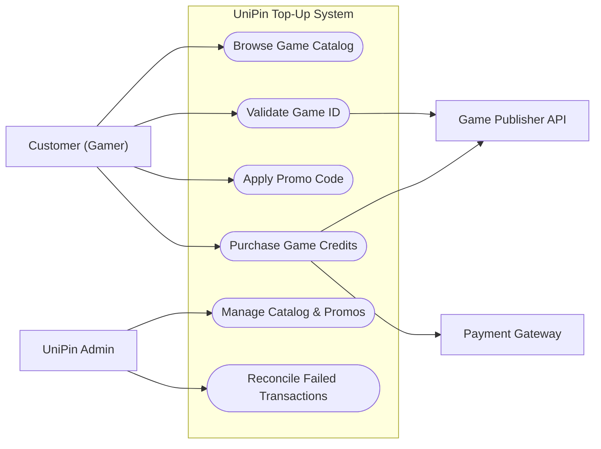
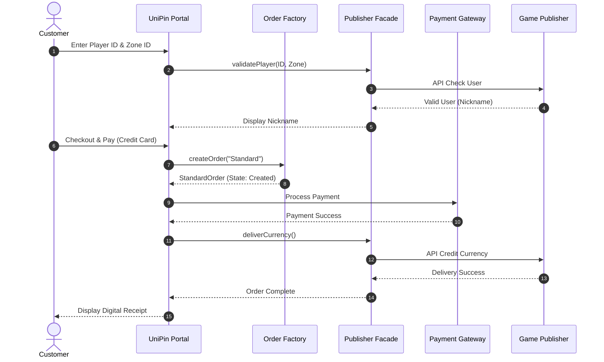
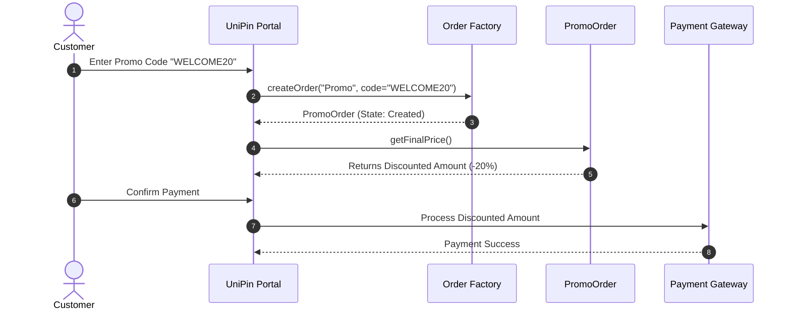
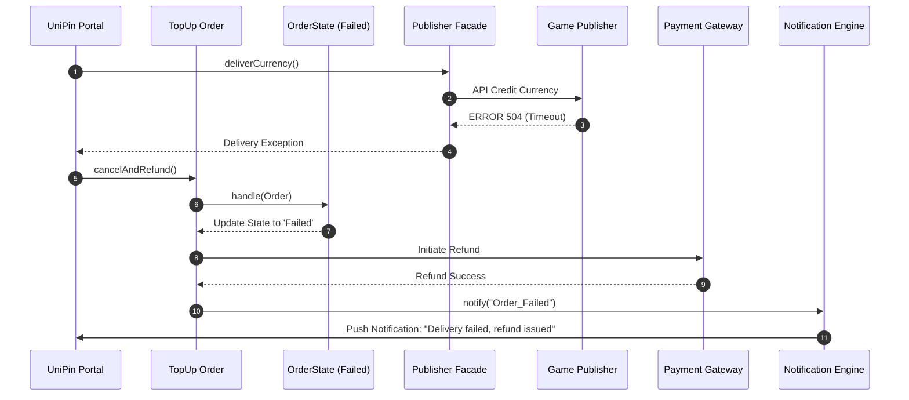
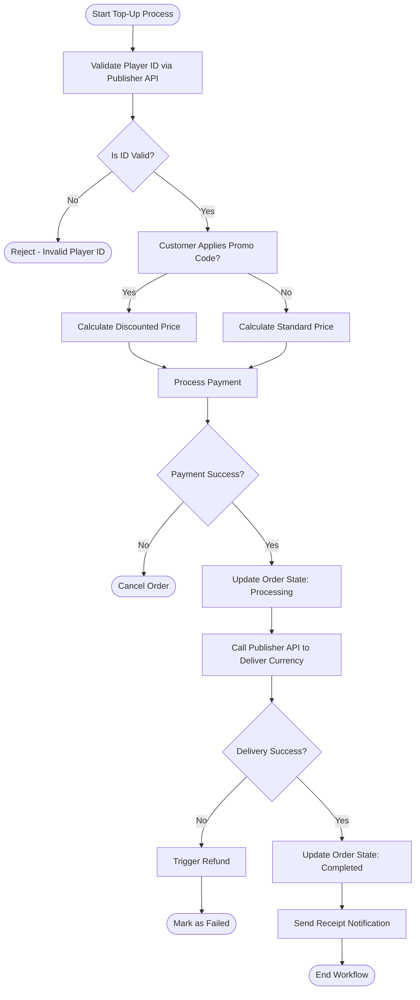
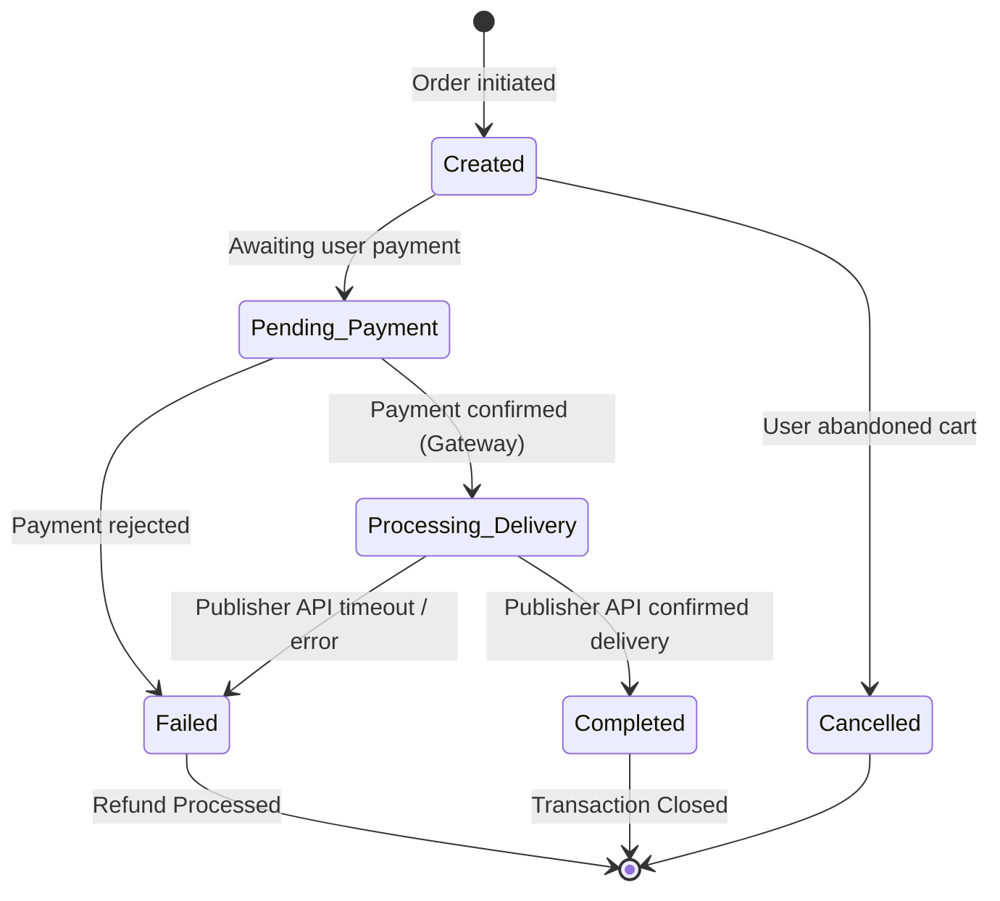
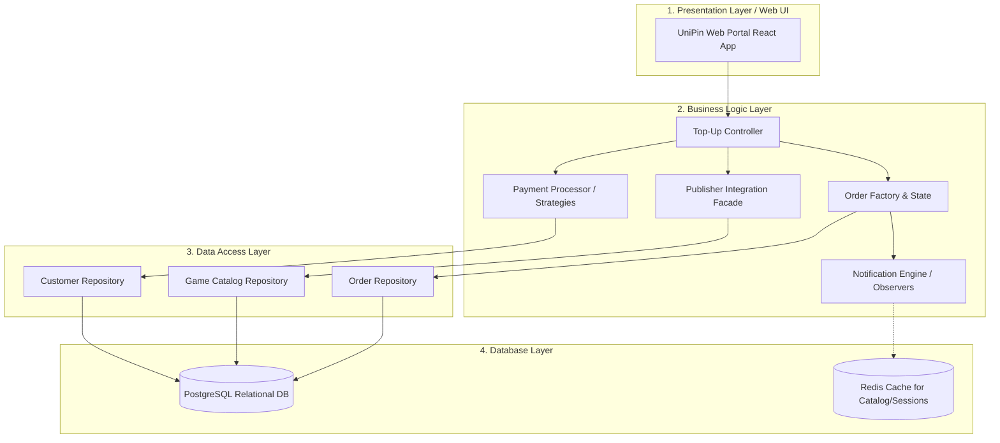

# FESE306 – Software Modeling & Design
## Final Project: Software Design Document (SDD)
**Project Name:** UniPin Game Top-Up System
**Team Members:** Kuy Visal, Kouch Bunpor, Ny Sihac, Rous Rendo
**Instructor:** Pen Voneat

---

## 1. Project Scenario & Overview

The **UniPin Game Top-Up System** acts as a centralized digital goods aggregator bridging Gamers, Payment Gateways, and Game Publishers.
- **Customers (Gamers)** browse catalogs, validate their game IDs, apply promotional discounts, and purchase in-game currency directly through the UniPin web portal.
- **UniPin System Admin** manages the game catalog, updates pricing, and creates promotional campaigns.
- The system handles real-time validation of Game IDs, processes payments through multiple channels (e.g., Credit Card, E-Wallets, Bank Transfers), and instantly fulfills orders via integrations with external **Game Publishers** (like Moonton, Tencent).
- The system includes robust failure handling, automatically rolling back and refunding transactions if a Game Publisher API times out.

---

## 2. UML Diagrams — Full Suite

### 2.1 Use Case Diagram
**Actors:** Customer (Gamer), UniPin Admin, Game Publisher API, Payment Gateway.
**Use Cases:** Browse Game Catalog, Validate Game ID, Purchase Game Credits, Apply Promo Code, Manage Catalog & Promos, Reconcile Transactions.

### 2.2 Class Diagram
This class diagram implements a clean layered design where `Order` is a **pure data entity**, `OrderService` is the **orchestrator**, promotions use the **Strategy pattern** (not inheritance), and `PaymentProcessor` **delegates** to focused sub-services instead of being a God class.

```mermaid
classDiagram
    %% ════════════════════════════════════════
    %% CORE DOMAIN — Entity Layer (Pure Data)
    %% ════════════════════════════════════════

    class User {
        +UUID userId
        +String email
        +String passwordHash
        +Money balance
    }

    class Game {
        +UUID gameId
        +String name
        +String publisher
    }

    class Order {
        +UUID orderId
        +UUID userId
        +UUID gameId
        +List~OrderItem~ items
        +OrderStatus status
        +Money baseAmount
        +Money finalAmount
        +DateTime createdAt
    }

    class OrderItem {
        +UUID itemId
        +String productName
        +int quantity
        +Money price
    }

    class OrderStatus {
        <<enumeration>>
        CREATED
        PROCESSING
        PAID
        DELIVERED
        FAILED
        REFUNDED
    }

    Order "1" *-- "1..*" OrderItem : contains
    Order "1" --> "1" User : belongs to
    Order "1" --> "1" Game : for game
    Order --> OrderStatus : has status

    %% ════════════════════════════════════════
    %% SERVICE LAYER — Business Logic
    %% ════════════════════════════════════════

    class OrderService {
        <<service>>
        +createOrder(userId UUID, gameId UUID) Order
        +checkout(orderId UUID) void
    }

    class PricingService {
        <<service>>
        +calculateBasePrice(order Order) Money
        +applyPromotion(order Order, promo Promotion) Money
    }

    %% ════════════════════════════════════════
    %% PROMOTION — Strategy Pattern
    %% ════════════════════════════════════════

    class Promotion {
        <<interface>>
        +apply(order Order) Money
    }

    class PercentageDiscountPromotion {
        +double percentage
        +apply(order Order) Money
    }

    class FixedAmountPromotion {
        +Money discountAmount
        +apply(order Order) Money
    }

    Promotion <|.. PercentageDiscountPromotion : implements
    Promotion <|.. FixedAmountPromotion : implements
    PricingService ..> Promotion : uses

    %% ════════════════════════════════════════
    %% PAYMENT — Orchestrator + Strategies
    %% ════════════════════════════════════════

    class PaymentProcessor {
        <<orchestrator>>
        +processPayment(order Order) PaymentResult
    }

    class PaymentStrategy {
        <<interface>>
        +pay(amount Money) PaymentResult
    }

    class CreditCardPayment {
        +pay(amount Money) PaymentResult
    }

    class BankTransferPayment {
        +pay(amount Money) PaymentResult
    }

    class PaymentGateway {
        <<adapter>>
        +charge(amount Money, method String) GatewayResponse
    }

    class PaymentValidator {
        +validate(order Order) boolean
    }

    class PaymentLogger {
        +logSuccess(orderId UUID) void
        +logFailure(orderId UUID, reason String) void
    }

    class RefundService {
        +refund(orderId UUID) void
    }

    PaymentStrategy <|.. CreditCardPayment : implements
    PaymentStrategy <|.. BankTransferPayment : implements
    PaymentProcessor ..> PaymentStrategy : uses Strategy
    PaymentProcessor ..> PaymentGateway : uses Adapter
    PaymentProcessor ..> PaymentValidator : uses
    PaymentProcessor ..> PaymentLogger : uses
    PaymentProcessor ..> RefundService : delegates

    %% ════════════════════════════════════════
    %% DELIVERY — Facade Pattern
    %% ════════════════════════════════════════

    class PublisherFacade {
        <<facade>>
        +deliver(order Order) DeliveryResult
    }

    class GarenaAPI {
        <<external>>
        +creditCurrency(playerId, amount)
    }

    class MoontonAPI {
        <<external>>
        +creditDiamond(playerId, amount)
    }

    class TencentAPI {
        <<external>>
        +topUpAccount(playerId, amount)
    }

    PublisherFacade ..> GarenaAPI : wraps
    PublisherFacade ..> MoontonAPI : wraps
    PublisherFacade ..> TencentAPI : wraps

    %% ════════════════════════════════════════
    %% ORCHESTRATION — OrderService wires all
    %% ════════════════════════════════════════

    OrderService ..> PricingService : uses
    OrderService ..> PaymentProcessor : uses
    OrderService ..> PublisherFacade : uses
    OrderService ..> Order : creates and manages
```

### 2.3 Sequence Diagrams (3 Flows)

#### Sequence 1: Direct Purchase Flow (Standard Order)
*A Customer selects a game, validates their ID, and pays via a payment gateway. UniPin delivers the goods.*

#### Sequence 2: Apply Promotion & Checkout
*A Customer applies a promo code. The system creates a `PromoOrder` which calculates a discounted final price.*

#### Sequence 3: Payment Failure & Auto-Refund
*A game publisher's API times out during delivery. UniPin transitions the order to Failed and issues a refund.*

### 2.4 Activity Diagram
*The complete logic workflow for processing a top-up request to completion.*

### 2.5 State Diagram
*State machine for the Order lifecycle.*

---

## 3. Design Pattern Application

We have applied **5 design patterns** to solve specific architectural problems in the UniPin System. The key fix from the previous version: `Order` is now a **pure data entity** — no behavior, no payment logic, no delivery logic.

| Pattern | Category | Problem Solved | Location in Class Diagram | Why Chosen |
| :--- | :--- | :--- | :--- | :--- |
| **1. Facade Pattern** | Structural | UniPin connects to Game Publishers (Moonton, Tencent, Garena), each with entirely different API structures and authentication. The core system must not know these details. | `PublisherFacade` wraps `GarenaAPI`, `MoontonAPI`, and `TencentAPI`. `OrderService` only calls `PublisherFacade.deliver(order)`. | Chosen over direct API calls so adding a new game publisher only requires updating the Facade, not the service layer. |
| **2. Strategy Pattern (Payment)** | Behavioral | Top-ups can be paid via Credit Card or Bank Transfer. Adding a new method must not require modifying `PaymentProcessor`. | `PaymentProcessor` delegates to the `PaymentStrategy` interface, implemented by `CreditCardPayment` and `BankTransferPayment`. | Chosen over `if/else` chains because payment behaviors are interchangeable at runtime. Satisfies the Open/Closed Principle. |
| **3. Strategy Pattern (Promotion)** | Behavioral | Discount logic can be percentage-based or fixed-amount. Using a subclass (`PromoOrder`) for each type violates the Open/Closed Principle and creates rigid inheritance. | `Promotion` interface implemented by `PercentageDiscountPromotion` and `FixedAmountPromotion`. `PricingService` applies the correct strategy. | Chosen over inheritance to make promotions composable and independently testable. New promo types added without touching `Order` or `PricingService`. |
| **4. Adapter Pattern** | Structural | Different payment gateways (Stripe, PayPal) have different APIs. `PaymentProcessor` must not be coupled to any specific gateway's SDK. | `PaymentGateway` acts as an adapter interface with a unified `charge(amount, method)` signature. Gateway-specific implementations translate this into vendor-specific calls. | Chosen to isolate vendor-specific integration code. Swapping from Stripe to PayPal requires only a new `PaymentGateway` implementation. |
| **5. Orchestrator (Service Layer)** | Architectural | A single checkout involves pricing, payment, delivery, and logging. Placing all this logic in `Order` (the entity) would create a God object anti-pattern. | `OrderService` orchestrates the full flow: calls `PricingService`, then `PaymentProcessor`, then `PublisherFacade`. `PaymentProcessor` further delegates to `PaymentValidator`, `PaymentLogger`, and `RefundService`. | Chosen to keep `Order` as a pure data entity. Each service has a single responsibility, making the system testable and maintainable. |

---

## 4. Layered Architecture Diagram

The system employs a strict 4-Tier Layered Architecture separating concerns from user interaction down to data storage.

### Layer Mapping Details:
1. **Presentation Layer:** Contains UI views for Customers. Maps to the **Actors** in the Use Case Diagram.
2. **Business Logic Layer:** Where the core algorithms and Design Patterns live. Maps directly to `PaymentProcessor`, `PublisherFacade`, `OrderFactory`, `OrderState`, and `NotificationEngine` from the Class Diagram.
3. **Data Access Layer:** Utilizes the Repository pattern to decouple SQL queries from business logic. Translates business objects into database records.
4. **Database Layer:** The raw storage engines maintaining ACID compliance for Customer data and Order states.
