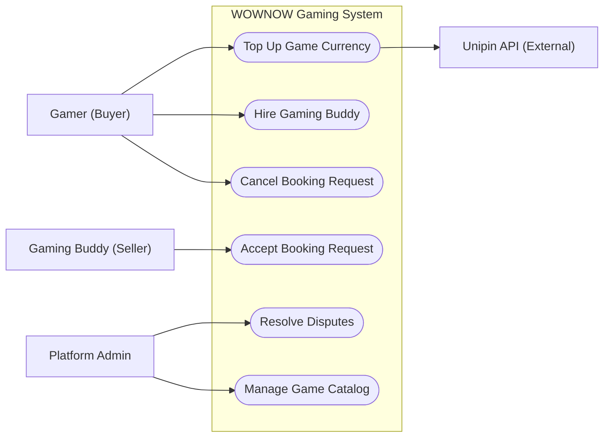
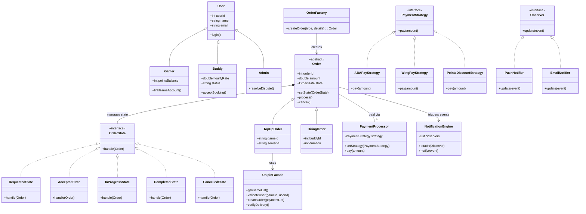
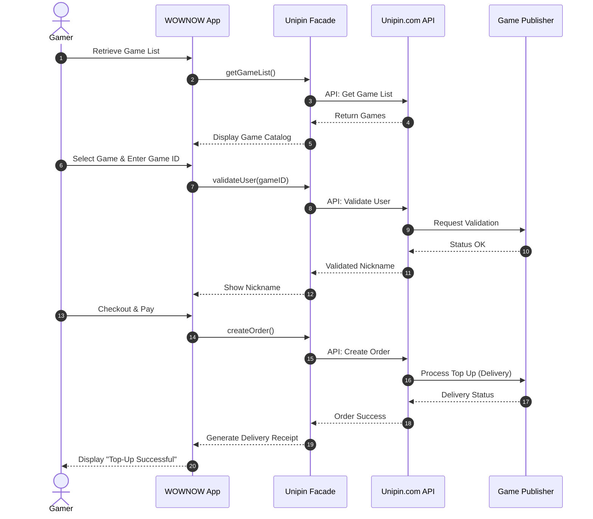
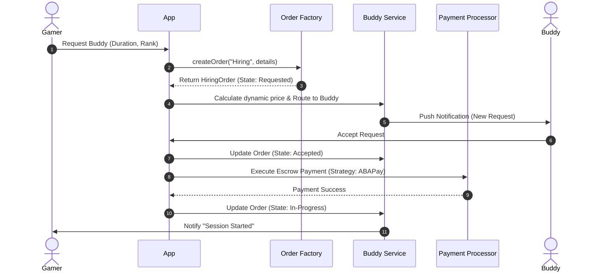
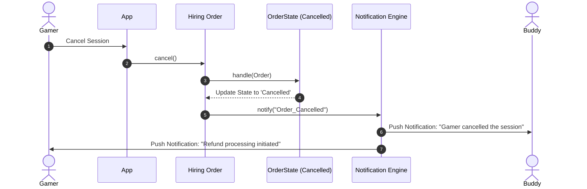
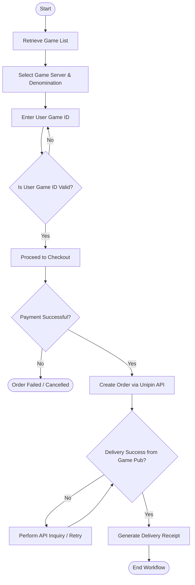
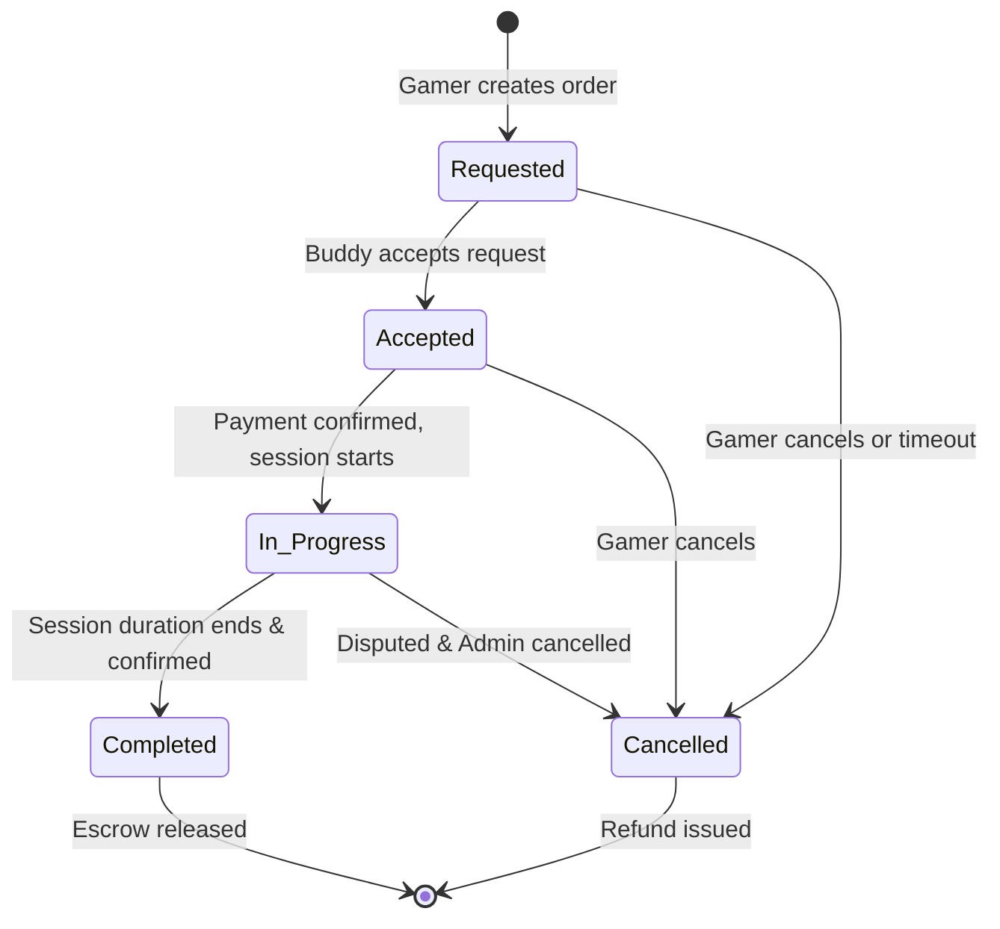
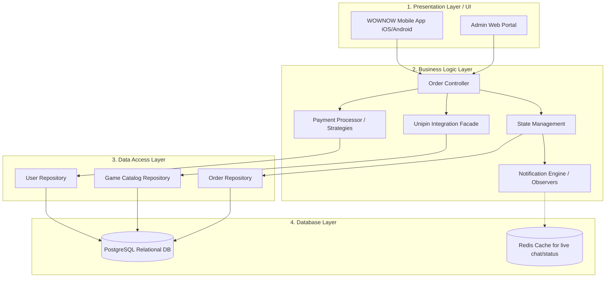

# FESE306 – Software Modeling & Design
## Final Project: Software Design Document (SDD)
**Project Name:** WOWNOW Gaming System (Top-up & Gaming Buddy)
**Team Members:** Kuy Visal, Kouch Bunpor, Ny Sihac, Rous Rendo
**Instructor:** Pen Voneat

---

## 1. Project Scenario & Overview

The **WOWNOW Gaming System** is an integrated feature within the WOWNOW super-app ecosystem. It serves a dual purpose:
1. **Digital Top-Up (via Unipin):** WOWNOW acts as a Reseller / Game Center, allowing gamers to purchase in-game currency. WOWNOW integrates with Unipin's API to retrieve game lists, validate user game IDs, create orders, and deliver digital goods directly to the user's game account.
2. **Gaming Buddy Marketplace:** A peer-to-peer service functioning similarly to ride-sharing. 
   - **Gamers (Buyers/Riders)** request companion sessions.
   - **Gaming Buddies (Sellers/Drivers)** accept requests and play with the gamers.
   - Orders follow a lifecycle: Requested → Accepted → In-Progress → Completed / Cancelled.
   - Real-time notifications and an admin module for dispute management are included.

---

## 2. UML Diagrams — Full Suite

### 2.1 Use Case Diagram
**Actors:** Gamer (Buyer), Gaming Buddy (Seller), Admin, Unipin API.
**Use Cases (min. 5):** Top Up Game Currency, Hire Gaming Buddy, Accept Booking, Resolve Dispute, Manage Game Catalog.

### 2.2 Class Diagram
This class diagram illustrates the full system model, incorporating the design patterns used for payment strategies, Unipin API facades, state management, and notifications.

### 2.3 Sequence Diagrams (3 Flows)

#### Sequence 1: Digital Top-Up via Unipin (Reseller Flow)
*This flow demonstrates WOWNOW acting as a Reseller integrating with Unipin to deliver digital game currency.*

#### Sequence 2: Hiring a Gaming Buddy
*This flow demonstrates requesting a buddy, dynamic pricing, and escrow payment.*

#### Sequence 3: Cancellation with Notification
*This flow demonstrates the Observer pattern in action when a Gamer cancels an order.*

### 2.4 Activity Diagram
*Workflow for the Reseller (WOWNOW) Purchase Flow via Unipin from start to finish.*

### 2.5 State Diagram
*State machine for the trip/order lifecycle (Requested → Accepted → In-Progress → Completed / Cancelled).*

---

## 3. Design Pattern Application

We have applied 5 design patterns to solve specific architectural problems in the WOWNOW Gaming System.

| Pattern | Category | Problem Solved | Location in Class Diagram | Why Chosen |
| :--- | :--- | :--- | :--- | :--- |
| **1. Facade Pattern** | Structural | WOWNOW's core system shouldn't deal with the complex low-level HTTP calls, headers, and multiple endpoints required to talk to Unipin (Game lists, validations, ordering). | `UnipinFacade` class. It shields `TopUpOrder` from the complexity of `UnipinAPI`. | Chosen over making direct REST calls from the Order class to ensure loose coupling. If we switch from Unipin to another aggregator, we only change the Facade, not the Order logic. |
| **2. Strategy Pattern** | Behavioral | Gamers need to pay using ABA Pay, Wing, or WOWNOW points. Writing `if/else` for every payment method makes the checkout code rigid. | `PaymentProcessor` uses the `PaymentStrategy` interface, implemented by `ABAPayStrategy`, `WingPayStrategy`, etc. | Chosen over inheritance because payment methods are interchangeable behaviors at runtime. It perfectly adheres to the Open/Closed Principle. |
| **3. State Pattern** | Behavioral | Orders have a strict lifecycle (Requested → Accepted → In-Progress → Completed). State transitions require complex validation (e.g., you can't cancel a Completed order). | `OrderState` interface and concrete classes (`RequestedState`, `AcceptedState`, etc.) managing the `Order`. | Chosen over massive switch statements inside the `Order` class. Each state handles its own rules and transitions cleanly. |
| **4. Observer Pattern** | Behavioral | When an order changes state or is cancelled, multiple unrelated subsystems (Email service, Push notification service, UI) need to react instantly. | `NotificationEngine` (Subject) and `Observer` interface implemented by `PushNotifier` and `EmailNotifier`. | Chosen because it allows us to add new notification methods (like SMS) without modifying the core `Order` logic. |
| **5. Factory Method** | Creational | We have two distinct types of transactions: Buying Game Currency (`TopUpOrder`) and booking a human (`HiringOrder`). Their initialization logic is entirely different. | `OrderFactory` class with `createOrder()` which produces an `Order`. | Chosen over direct instantiation (`new TopUpOrder()`) in the UI controllers, centralizing the complex creation logic and ensuring dependency inversion. |

---

## 4. Layered Architecture Diagram

The system employs a strict 4-Tier Layered Architecture separating concerns from user interaction down to data storage.

### Layer Mapping details:
1. **Presentation Layer:** Contains UI views for Gamers and Buddies. Maps to the **Actors** in the Use Case Diagram.
2. **Business Logic Layer:** Where the core algorithms and Design Patterns live. Maps directly to `PaymentProcessor`, `UnipinFacade`, `OrderFactory`, `OrderState`, and `NotificationEngine` from the Class Diagram.
3. **Data Access Layer:** Utilizes the Repository pattern to decouple SQL queries from business logic. Translates Java/C# objects into database records.
4. **Database Layer:** The raw storage engines maintaining ACID compliance for escrows and transactions.
