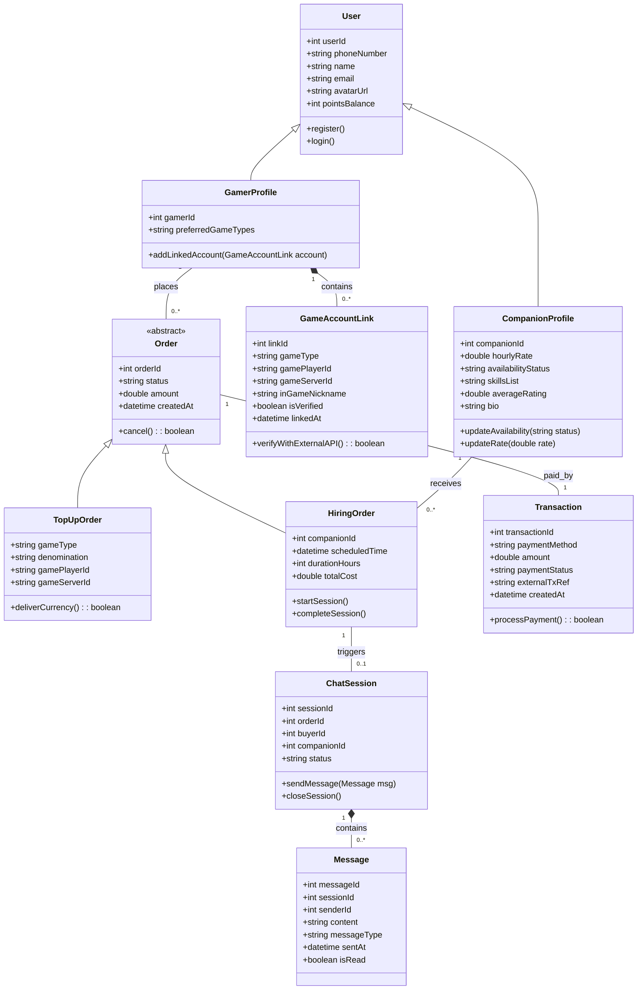
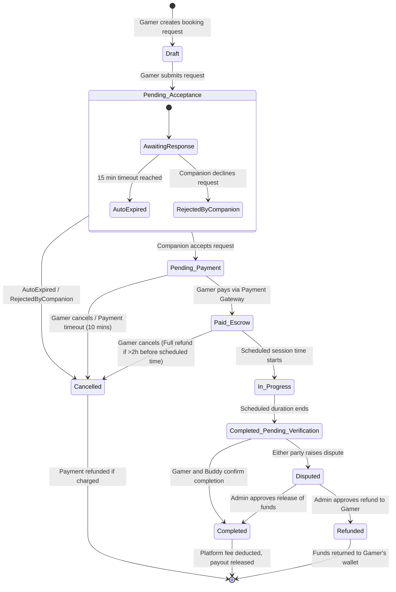
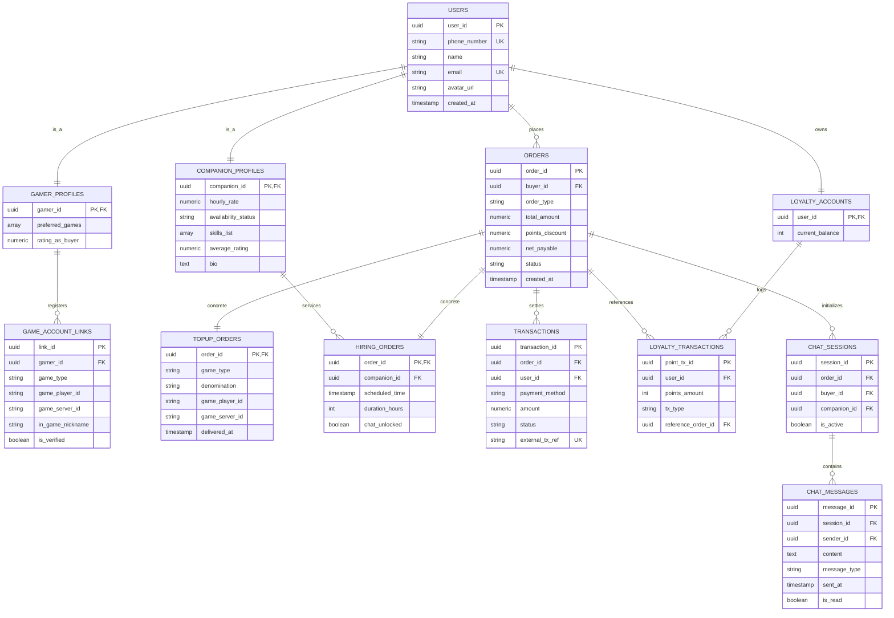
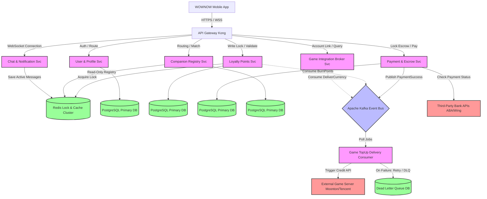

# Software System Analysis & Modeling Report: WOWNOW Gaming System

**Course:** Software System Analysis & Modeling (Programming Year III)  
**Institution:** Camtech University  
**Team Members:**  
1. Kuy Visal  
2. Kouch Bunpor  
3. Ny Sihac  
4. Rous Rendo  
**Submission Date:** May 20, 2026  
**Status:** Mid-Term Submission (Final Deliverable)

---

## Table of Contents
1. [Section A: Introduction](#section-a-introduction)
2. [Section B: Functional Analysis](#section-b-functional-analysis)
3. [Section C: Requirements Analysis](#section-c-requirements-analysis)
4. [Section D: UML Modeling](#section-d-uml-modeling)
   - [1. Use Case Diagram](#1-use-case-diagram)
   - [2. Class Diagram](#2-class-diagram)
   - [3. Sequence Diagram A: Direct Game Top-up System](#3-sequence-diagram-a-direct-game-top-up-system)
   - [4. Sequence Diagram B: Gaming Buddy Registration & Hiring System](#4-sequence-diagram-b-gaming-buddy-registration--hiring-system)
   - [5. Activity Diagram (Companion Hiring Lifecycle)](#5-activity-diagram)
   - [6. State Diagram (Hiring Order State Machine)](#6-state-diagram)
5. [Section E: Architecture & Design Evaluation](#section-e-architecture--design-evaluation)
6. [Section F: Improvement Recommendations](#section-f-improvement-recommendations)
7. [Bonus Challenge: Database Schema & Redesigned Architecture](#bonus-challenge-database-schema--redesigned-architecture)
   - [Probable Database Schema (SQL DDL)](#probable-database-schema-sql-ddl)
   - [Database Entity-Relationship (ER) Diagram](#database-entity-relationship-er-diagram)
   - [Proposed Redesigned Architecture](#proposed-redesigned-architecture)
8. [References](#references)

---

## Section A: Introduction

### 1. Overview of Selected Software
WOWNOW is widely recognized in Cambodia as a leading super-app offering local services such as food delivery, ride-hailing, package delivery, and e-commerce. However, beyond these traditional on-demand services, WOWNOW has expanded into the gaming sector via its dedicated **WOWNOW Gaming System** (accessible through the mobile application and the web-portal [wowgame.wownow.net](https://wowgame.wownow.net/home)). 

The WOWNOW Gaming System functions as a centralized gateway for gamers, providing two primary pillars of value:
1. **Direct Game Top-up & Currency Purchase Portal:** Allows gamers to link their accounts and buy in-game currencies (such as Mobile Legends Diamonds, PUBG Mobile UC, Roblox Robux, etc.) with instant, automated delivery.
2. **Gaming Buddies Marketplace (Escort / Companion Play):** An interactive peer-to-peer marketplace where users can hire skilled "Gaming Buddies" (pro-players or gaming companions) on an hourly basis to play games together, carry them to higher ranks, or socialize.

### 2. Team Selection Rationale
Our team chose the WOWNOW Gaming System because it presents a unique convergence of two technically challenging software engineering domains:
- **Instant Digital Asset Delivery:** The system must process real-time payments and trigger immediate API webhooks to third-party game servers (e.g., Moonton, Tencent) to credit the user’s game account in seconds.
- **Peer-to-Peer Marketplace & Live Coordination:** The "Gaming Buddies" feature functions similarly to ride-hailing (real-time availability, companion discovery, per-hour escrow billing) but integrates real-time chat, push notifications, and game account synchronization.

Analyzing this system allows us to study transactional integrity, distributed API integrations, escrow billing state machines, and real-time messaging architectures.

### 3. Target Users & Stakeholders
The primary stakeholders of the WOWNOW Gaming System include:
* **Gamer (Buyer):** Casual or competitive players looking to top up game currency quickly or hire experienced companions to assist them in climbing ranks or hanging out.
* **Gaming Buddy (Companion / Seller):** High-skilled players who monetize their gaming talent by offering carrying services, coaching, or casual companionship at an hourly rate.
* **Game Developers / Publishers (Partners):** Third-party entities (like Moonton, Garena, Krafton) that provide APIs for ID verification and currency crediting.
* **WOWNOW Platform Administrators:** Staff responsible for verifying gaming buddies' profiles, managing currency catalog prices, auditing chat logs for safety, and resolving payment disputes.
* **Payment Service Providers (PSPs):** Financial institutions (e.g., ABA Bank, Wing, Acleda) facilitating fiat payments.

### 4. Main Business Purpose
WOWNOW's business goal with this gaming system is threefold:
* **Ecosystem Retention:** Convert WOWNOW’s massive user base (food delivery and ride-hailing) into gaming consumers by enabling them to spend accumulated reward points (WOWNOW Points) as discounts on game top-ups.
* **Monetization:** Generate revenue through transaction margins on game currency top-ups and take a platform commission fee (e.g., 10-20%) on every hour of companion hiring orders.
* **Engagement:** Create a sticky, social gaming community within the super-app, driving daily active usage (DAU) through game-related content and pro-player social interactions.

---

## Section B: Functional Analysis

### 1. Core Features & Modules
The WOWNOW Gaming System consists of six main functional modules:
* **Game Account Linker:** Integrates with game publisher servers. Users enter their external Game UID and Server ID (e.g., Mobile Legends). The system verifies the ID and returns the in-game nickname, linking it to the WOWNOW profile to prevent delivery errors.
* **Top-up & Payment Gateway:** Integrates local payment methods (ABA Pay, Wing, Mastercard/Visa) to purchase digital gaming packages.
* **Gaming Buddies Marketplace:** Allows users to search, filter (by game type, rank, language, gender, rating), and book gaming companions.
* **Real-time Chatting:** Facilitates communication between the buyer and the gaming companion before and during the active hiring session.
* **Push Notifications:** Alerts users about transaction approvals, game currency delivery, companion booking requests, and chat messages.
* **Points Exchange System:** Implements loyalty logic where users convert points earned from other WOWNOW services (e.g., food orders) into top-up discounts.

### 2. Key User Roles & Permissions

| Role | Permissions & Access Levels |
| :--- | :--- |
| **Guest User** | Browse the game currency catalog, view public profiles of Gaming Buddies. Cannot top up, chat, or book sessions. |
| **Gamer (Buyer)** | Link game accounts, initiate top-ups, apply points discounts, book and pay for Gaming Buddies, chat, rate/review companions, raise disputes. |
| **Gaming Buddy (Seller)** | Create/manage companion profile, set hourly rates, update availability status, accept/decline booking requests, chat with buyers, view earned balance. |
| **Platform Administrator** | Approve/reject Gaming Buddy applications, moderate public profiles and chat logs, manage game currency catalogs and pricing, resolve user disputes, issue refunds. |

### 3. Major Workflows
* **Workflow 1: Account Verification & Top-up Delivery:**
  1. Gamer inputs Game UID and Server ID.
  2. System requests external validation from the specific game publisher API.
  3. External server returns the Player Nickname.
  4. Gamer confirms the nickname matches, selects a currency package, and initiates payment.
  5. Payment is processed. The system sends a delivery request hook to the game publisher API.
  6. In-game currency is instantly credited to the user's account, and a push notification is sent.

* **Workflow 2: Gaming Buddy Hiring & Escrow Settlement:**
  1. Gamer selects a Gaming Buddy, specifies duration (e.g., 2 hours), and sends a request.
  2. The Gaming Buddy is notified and accepts the request within a timeout window.
  3. Gamer pays the fee, which the system places in an escrow wallet.
  4. The chat channel is unlocked, and the session begins at the scheduled time.
  5. After the session, the Gamer and Gaming Buddy confirm completion.
  6. The system releases the funds (minus platform fee) to the Gaming Buddy's earnings wallet.

---

## Section C: Requirements Analysis

### 1. Functional Requirements (FRs)

To ensure clear accountability and scope, the functional requirements of the WOWNOW Gaming System are organized by actor roles: **Gamer (Buyer)**, **Gaming Buddy (Seller)**, and **Platform Administrator**.

#### A. Gamer (Buyer) Functional Requirements
* **FR-G-01 (Game Linkage & Integration):** The system shall allow gamers to register and link their external game IDs and Server IDs (e.g., Mobile Legends, PUBG Mobile) to their WOWNOW account.
* **FR-G-02 (External Player Verification):** The system must query third-party game publisher APIs (e.g., Moonton) to validate the gamer's account and retrieve the in-game nickname for visual confirmation.
* **FR-G-03 (Digital Currency Top-up):** The system shall allow gamers to select digital currency packages (e.g., Diamonds, UC) and trigger automated crediting to the linked game account upon payment.
* **FR-G-04 (Payment Processing):** The system shall process payments securely using local payment methods, including ABA Pay, Wing Pay, and international Credit Cards (Visa/Mastercard).
* **FR-G-05 (Loyalty Points Redemption):** The system shall allow gamers to redeem accumulated WOWNOW reward points as instant cash discounts during checkout, updating their ledger balance immediately.
* **FR-G-06 (Buddy Discovery & Search):** The system shall provide gamers with a searchable directory of Gaming Buddies, with advanced filtering options (by game, hourly rate, skill rank, rating, and online availability).
* **FR-G-07 (Session Booking & Payment):** The system shall enable gamers to book gaming sessions (specifying date, start time, and duration) and lock the total order fee securely in an escrow wallet.
* **FR-G-08 (Real-time Pre- & Active Chat):** The system shall provide gamers with real-time text and voice chat capabilities with companions to coordinate before and during booked sessions.
* **FR-G-09 (Review & Rating System):** The system shall allow gamers to submit a 1-to-5 star rating and a text review of their gaming companion upon completing a hiring order.
* **FR-G-10 (Dispute Filing):** The system shall enable gamers to raise disputes on active or recently completed hiring orders and submit transactional evidence for refund mediation.

#### B. Gaming Buddy (Seller) Functional Requirements
* **FR-B-01 (Profile Creation & Showcase):** The system shall allow verified companions to set up public profiles, customize hourly rates, list gaming specialties, and upload voice clips, screenshots, or rank badges.
* **FR-B-02 (Availability & Status Management):** The system shall allow companions to toggle their active booking status between 'Online' (available for immediate hire), 'Offline', or 'Busy'.
* **FR-B-03 (Booking Response Workflow):** The system shall notify companions of incoming gamer booking requests, allowing them to accept or decline the request within a 15-minute timeout window.
* **FR-B-04 (Active Session Chat):** The system shall unlock a dedicated chat channel for the companion to coordinate with the gamer once the booking fee is locked in escrow.
* **FR-B-05 (Earnings Tracking & Payouts):** The system shall maintain an earnings balance for each companion, deduct the platform commission fee (15%), and allow companions to request bank account payouts.
* **FR-B-06 (Rating & Feedback Viewer):** The system shall provide companions with an analytics interface to view their average ratings, gamer reviews, and platform feedback.

#### C. Platform Administrator Functional Requirements
* **FR-A-01 (Buddy Profile Vetting & Auditing):** The system shall allow admins to review companion applications, verify submitted credentials (e.g., national ID, skill certificates), and approve or reject profiles.
* **FR-A-02 (Catalog & Pricing Management):** The system shall enable admins to manage the game currency catalog, update pricing packages, configure points-to-cash conversion rates, and add new game integrations.
* **FR-A-03 (Dispute Resolution Portal):** The system shall provide admins with a dispute dashboard to view raised order issues, inspect decrypted chat histories, and trigger escrow release to the companion or initiate refunds to the gamer.
* **FR-A-04 (Chat & Activity Moderation):** The system shall provide automated filters and admin tools to scan public profiles and chat logs for policy violations, toxic language, or off-platform payment attempts.
* **FR-A-05 (Transaction and Audit Logging):** The system shall generate comprehensive financial, point redemption, and delivery reports for admins to track system performance and trace payment failures.


### 2. Non-Functional Requirements (NFRs)

#### A. Performance
* **NFR-P1 (Latency):** Account validation responses from the game integration engine must return within 2.0 seconds under normal network conditions.
* **NFR-P2 (Top-up Speed):** Digital currency delivery must be completed within 15 seconds of payment authorization in 95% of transactions.
* **NFR-P3 (Chat Sync):** Real-time message delivery must have a latency of less than 300 milliseconds.

#### B. Security
* **NFR-S1 (Data Encryption):** All user credentials and payment tokens must be encrypted in transit using TLS 1.3 and at rest using AES-256.
* **NFR-S2 (Access Control):** The system must enforce Role-Based Access Control (RBAC) and validate JWT tokens on every microservice request.
* **NFR-S3 (Escrow Safety):** Transactions must be processed through ACID-compliant database writes, preventing double-spending of reward points or payment credits.

#### C. Scalability
* **NFR-Sc1 (Concurrent Users):** The system must support up to 50,000 concurrent active users and 1,000 transactions per minute during peak times (e.g., evening hours and weekend gaming events).
* **NFR-Sc2 (Storage Scaling):** Chat database storage must support horizontal partitioning (sharding) based on Session ID to handle millions of daily messages.

#### D. Usability
* **NFR-U1 (Mobile Ergonomics):** The checkout flow for topping up game currency must take no more than 3 taps from the home screen.
* **NFR-U2 (Language Support):** The interface must support localization in Khmer, English, and Chinese.

#### E. Reliability
* **NFR-R1 (High Availability):** The payment and top-up modules must achieve 99.9% uptime (maximum 8.76 hours of unscheduled downtime per year).
* **NFR-R2 (Fault Tolerance):** If the external game API is down, the payment system must hold the order in a "Pending Delivery" state and retry automatically using exponential backoff, rather than failing silently and losing user funds.

---

## Section D: UML Modeling

### 1. Use Case Diagram
This diagram shows the interactions of the three main system actors (Gamer, Gaming Buddy, Admin) and secondary system actors (Payment Gateway, External Game API) with the WOWNOW Gaming System use cases.

```mermaid
flowchart LR
    %% Actors
    Gamer["Gamer (Buyer)"]
    Buddy["Gaming Buddy (Seller)"]
    Admin["Platform Admin"]
    PayGateway["Payment Gateway"]
    GameAPI["External Game API"]

    %% System Boundary
    subgraph WOWNOW_Gaming_System ["WOWNOW Gaming System"]
        UC_LinkAccount(["Link Game Account"])
        UC_VerifyID(["Verify Game Player ID"])
        UC_TopUp(["Purchase In-Game Currency"])
        UC_ApplyPoints(["Apply Points Discount"])
        UC_HireBuddy(["Hire Gaming Buddy"])
        UC_Chat(["Real-time Chatting"])
        UC_ManageProfile(["Manage Buddy Profile"])
        UC_AcceptBooking(["Accept Booking Request"])
        UC_Disputes(["Resolve Disputes"])
        UC_ApproveBuddy(["Verify & Approve Buddy Profile"])
    end

    %% Gamer associations
    Gamer --> UC_LinkAccount
    Gamer --> UC_TopUp
    Gamer --> UC_HireBuddy
    Gamer --> UC_Chat

    %% Buddy associations
    Buddy --> UC_Chat
    Buddy --> UC_ManageProfile
    Buddy --> UC_AcceptBooking

    %% Admin associations
    Admin --> UC_ApproveBuddy
    Admin --> UC_Disputes

    %% Relationships inside boundary
    UC_LinkAccount -.->|includes| UC_VerifyID
    UC_TopUp -.->|extends| UC_ApplyPoints

    %% External System associations
    UC_VerifyID --> GameAPI
    UC_TopUp --> PayGateway
    UC_HireBuddy --> PayGateway
```



**Walkthrough:**
- **Account Linkage:** The Gamer initiates `Link Game Account`. The system executes `Verify Game Player ID` which relies on the `External Game API` (Moonton/Tencent) to check if the user credentials exist and fetch the profile name.
- **Top-Up:** The Gamer initiates `Purchase In-Game Currency`, triggering payment processing through the `Payment Gateway`. The transaction optionally invokes `Apply Points Discount` to reduce the cost using WOWNOW loyalty points.
- **Hiring Flow:** The Gamer books a companion via `Hire Gaming Buddy`, which requires payments processed through the `Payment Gateway`. The Gaming Buddy manages their status via `Manage Buddy Profile` and approves requests via `Accept Booking Request`.
- **Administrative Control:** The Platform Admin handles backend moderation: verifying new gaming companions (`Verify & Approve Buddy Profile`) and settling transactional issues (`Resolve Disputes`).

---

### 2. Class Diagram
The class diagram captures the static structure of the WOWNOW Gaming domain, including profiles, linked accounts, orders, transactions, and real-time chat models.



**Walkthrough:**
- **Inheritance Pattern:** `GamerProfile` and `CompanionProfile` inherit from `User`. A single user can act as a buyer, and after verification, also list themselves as a companion.
- **Account Linking:** A `GamerProfile` has a one-to-many composition with `GameAccountLink`, enabling a user to save links for multiple game titles.
- **Order Specialization:** `Order` is an abstract class with two concrete implementations: `TopUpOrder` (requires external currency delivery) and `HiringOrder` (requires reservation of companion hours).
- **Payment Linkage:** Each `Order` is associated with exactly one `Transaction` representing the real-world payment.
- **Chat Associations:** A `HiringOrder` triggers a `ChatSession` between the buyer (`GamerProfile`) and seller (`CompanionProfile`), which aggregates individual `Message` objects.

---

### 3. Sequence Diagram A: Direct Game Top-up System

This sequence diagram details the transactional flow of the automated game top-up system, where the system communicates directly with the external Game Publisher API using the user's `playerId` and `zoneId` for player verification and real-time currency delivery.

```mermaid
sequenceDiagram
    autonumber
    actor Gamer as Gamer (App Client)
    participant Gateway as API Gateway
    participant Linker as Game Linker Service
    participant Pay as Payment Service
    participant MQ as Message Queue (Kafka)
    participant GameAPI as External Game Publisher API
    participant DeliverySvc as Delivery Broker Svc

    rect rgb(20, 20, 20)
        Gamer->>Gateway: Input playerId & zoneId
        Gateway->>Linker: Validate game account (playerId, zoneId)
        Linker->>GameAPI: Query player nickname (playerId, zoneId)
        GameAPI-->>Linker: Return player nickname (e.g., "ZilongMaster")
        Linker-->>Gateway: Verification Success ("ZilongMaster")
        Gateway-->>Gamer: Show Nickname for confirmation

        Gamer->>Gateway: Select 1000 Diamonds Package
        Gateway->>Pay: Create Payment Intention ($15)
        Pay-->>Gamer: Return ABA Pay Deep Link

        Gamer->>Pay: Approve payment on ABA Mobile App
        Pay-->>Gateway: Payment Status Hook (SUCCESS, Ref: ABA-9988)
        Gateway->>MQ: Publish "TopUpOrderApproved" event (playerId, zoneId, Package Info)
        Gateway-->>Gamer: Display "Payment Success, delivery in progress"

        critical Asynchronous Direct Game API Delivery
            MQ->>DeliverySvc: Consume "TopUpOrderApproved"
            DeliverySvc->>GameAPI: Direct API Call: Credit 1000 Diamonds to playerId & zoneId
            GameAPI-->>DeliverySvc: Confirm Credit Success
            DeliverySvc->>Gateway: Notify Order Complete
            Gateway->>Gamer: Send Push Notification: "Diamonds Credited Successfully!"
        end
    end
```



**Walkthrough:**
1. **Verification Phase (1–6):** The Gamer inputs their unique `playerId` and `zoneId`. The `Game Linker Service` queries the external Game Publisher API directly to retrieve the registered nickname, preventing user typos from causing digital currency loss.
2. **Checkout & Payment Initiation (7–9):** The user selects their desired game currency package. The gateway coordinates with the `Payment Service` to register a pending transaction and retrieves the deep link for ABA Mobile App payment.
3. **Payment Completion (10–12):** The gamer authorizes the payment inside their bank application. Upon receiving the PSP webhook notification, the gateway publishes the payment confirmation details directly to the Kafka event bus and displays a success screen to the client.
4. **Asynchronous Fulfillment (13–17):** The `Delivery Broker Service` consumes the event and instantly triggers a direct API call to the Game Publisher's credit engine. Once complete, it alerts the Gamer via a push notification.

---

### 4. Sequence Diagram B: Gaming Buddy Lifecycle (Registration, Approval, & Hiring Flow)

This sequence diagram illustrates the dual paths of a normal user in the Gaming Buddy system:
1. **Buddy Registration & Vetting Path:** Where a normal user submits an application detailing their rank credentials, which is manually reviewed and either approved or rejected by the WOWNOW Admin Team.
2. **Buddy Hiring / Carrying Path:** Where a normal user searches the directory and hires an approved companion, booking their services through an escrow payment system to coordinate play sessions.

```mermaid
sequenceDiagram
    autonumber
    actor NormalUser as Normal User / Gamer
    actor Admin as WOWNOW Admin Team
    actor Buddy as Approved Gaming Buddy
    participant App as WOWNOW Mobile App
    participant Gateway as API Gateway
    participant BuddySvc as Companion Registry Service
    participant BookingSvc as Booking & Escrow Service
    participant PaySvc as Payment Service

    %% OPTION 1: BECOMING A GAMING BUDDY
    rect rgb(240, 248, 255)
        note right of NormalUser: Option 1: Apply to Become a Gaming Buddy
        NormalUser->>App: Click "Become a Gaming Buddy"
        App->>NormalUser: Display application form (Upload rank screenshots, voice clip, set hourly rate)
        NormalUser->>App: Submit Application Data
        App->>Gateway: POST /buddies/apply (Upload documents)
        Gateway->>BuddySvc: Save Application (Status: PENDING_REVIEW)
        BuddySvc-->>App: Acknowledge submission (Display: "Application under review")
        
        %% Admin Review Process
        Admin->>App: Access Admin Panel (Get pending applications)
        App->>Gateway: GET /admin/buddies/pending
        Gateway->>BuddySvc: Fetch list of pending buddy applications
        BuddySvc-->>Admin: Return list of portfolios & documents
        Admin->>Admin: Verify rank screenshot & listen to voice clip
        
        alt Application Approved
            Admin->>App: Click "Approve Profile"
            App->>Gateway: POST /admin/buddies/approve (userId)
            Gateway->>BuddySvc: Update status to APPROVED & role to GAMING_BUDDY
            BuddySvc-->>Admin: Success
            BuddySvc->>App: Dispatch Push Notification ("Congratulations! You are now a Gaming Buddy")
        else Application Rejected
            Admin->>App: Click "Reject Profile" (Specify reason)
            App->>Gateway: POST /admin/buddies/reject (userId, reason)
            Gateway->>BuddySvc: Update status to REJECTED
            BuddySvc-->>Admin: Success
            BuddySvc->>App: Dispatch Push Notification ("Application Rejected")
        end
    end

    %% OPTION 2: HIRING A GAMING BUDDY
    rect rgb(20, 20, 20)
        note right of NormalUser: Option 2: Hire a Gaming Buddy to Carry/Play
        NormalUser->>App: Search & filter Gaming Buddies directory
        App->>Gateway: GET /buddies?game=MLBB&rank=Mythic
        Gateway->>BuddySvc: Query active & online companions
        BuddySvc-->>NormalUser: Return matching buddy list
        
        NormalUser->>App: Select Buddy & send Booking Request (Duration: 2 hours)
        App->>Gateway: POST /bookings (buddyId, hours)
        Gateway->>BookingSvc: Create Booking (Status: PENDING_ACCEPTANCE)
        BookingSvc->>App: Notify Buddy of incoming hire request
        Buddy->>App: Click "Accept Booking"
        App->>Gateway: POST /bookings/{id}/accept
        Gateway->>BookingSvc: Update booking status to PENDING_PAYMENT
        
        NormalUser->>App: Proceed to checkout
        App->>Gateway: POST /payments/checkout (bookingId)
        Gateway->>PaySvc: Secure booking fee in ESCROW wallet
        PaySvc-->>NormalUser: Payment Success (Status: PAID_ESCROW)
        
        note over NormalUser, Buddy: Play Session: Buddy carries Gamer to higher rank
        
        NormalUser->>App: Confirm session completed successfully
        App->>Gateway: POST /bookings/{id}/complete
        Gateway->>BookingSvc: Update status to COMPLETED
        BookingSvc->>PaySvc: Trigger Escrow Release (Deduct 15% platform commission)
        PaySvc->>BuddySvc: Credit remaining 85% to Buddy's earnings balance
        PaySvc-->>Buddy: Send notification: "Payout credited to your balance"
    end
```



**Walkthrough:**
1. **Application Lifecycle (1–7):** A user applies to monetize their gaming skills. The application containing their tier accomplishments and pricing guidelines is held in a `PENDING_REVIEW` state.
2. **Administrative Vetting (8–12):** The WOWNOW Admin Team accesses the portal to audit application portfolios.
3. **Approval Threshold (13–18):** If the portfolio checks pass (such as win rates and profile pictures), the admin approves the application. The user's system role shifts to `GAMING_BUDDY`, making them visible on the companion feed. Otherwise, it is rejected and feedback is issued.
4. **Buddy Discovery & Booking (19–25):** Gamers filter and choose available companions from the catalog. The selected buddy has a 15-minute timeframe to accept the booking request.
5. **Escrow Guarantee (26–28):** Once accepted, the gamer completes checkout. The platform holds the payment in an escrow balance, safeguarding the transaction.
6. **Execution & Release (29–34):** The duo plays together. Once completed, the gamer confirms order closure. The platform processes the order, deducting its 15% platform cut, and deposits the remaining 85% in the companion's earnings wallet.

---


### 5. Activity Diagram
This activity diagram tracks the workflow of hiring a companion, representing the business logic constraints, timeouts, escrow payments, and feedback loop.

```mermaid
flowchart LR
    %% Start node
    Start([Start]) --> Browse["Browse Companions Directory"]
    Browse --> Filter{"Apply Filters?"}
    Filter -->|Yes| ApplyFilters["Filter by Game, Rank, Rating"] --> Browse
    Filter -->|No| PreChat["Initiate Pre-booking Chat"]
    
    PreChat --> SubmitBooking["Submit Booking Request (Duration, Time)"]
    SubmitBooking --> BuddyReview{"Buddy Reviews Request"}
    
    BuddyReview -->|Declined / Timeout| Cancel([Request Cancelled])
    BuddyReview -->|Accepted| PayBooking["Pay Booking Fee"]
    
    PayBooking --> LockEscrow["System Locks Fee in Escrow"]
    LockEscrow --> WaitTime["Wait for Scheduled Session Time"]
    WaitTime --> StartSession["Start Gaming Session (Play Together)"]
    StartSession --> EndSession["Session Completed (Duration Expired)"]
    
    EndSession --> ConfirmCompletion{"Both Confirm Completion?"}
    ConfirmCompletion -->|Yes| Payout["Release Escrow Funds (Less Platform Commission)"]
    ConfirmCompletion -->|Discrepancy / Dispute| AdminEscalation["Escalate to Platform Admin"]
    
    AdminEscalation --> AdminReview{"Admin Decision"}
    AdminReview -->|Buddy Fulfilled| Payout
    AdminReview -->|Buddy Flaked / Refund| Refund["Refund Funds to Gamer"]
    
    Payout --> Feedback["Gamer Submits Rating & Review"]
    Refund --> Finish([End])
    Feedback --> Finish
    Cancel --> Finish
```



**Walkthrough:**
- **Discovery Stage:** Users search and filter the directory. A chat window is opened to discuss availability and goals before formalizing the order.
- **Booking Submission:** The user submits a booking order. The companion must respond within a 15-minute time window, or the order is auto-cancelled.
- **Financial Escrow:** Once the companion accepts, the user submits payment. Funds are locked in escrow to guarantee payment safety for the seller and service fulfillment for the buyer.
- **Execution & Release:** When the playtime expires, both users submit a completion check. If both confirm, the platform deducts its commission and credits the companion's wallet. If there is a dispute, administrators inspect chat transcripts to distribute the refund.

---

### 6. State Diagram
This state diagram represents the lifecycle of a `HiringOrder` (companion booking), displaying valid transitions, edge cases, and dispute paths.



**Walkthrough:**
- **Awaiting Confirmation:** When the booking is initialized, it enters `Pending_Acceptance`. The companion must accept. If rejected or timed out, the request is marked `Cancelled`.
- **Payment Pending:** After acceptance, the gamer must complete payment within 10 minutes to progress to `Paid_Escrow`, otherwise the reservation expires.
- **Escrow Operations:** While in `Paid_Escrow`, the gamer can cancel and get a full refund up to 2 hours before the start time.
- **Execution & Arbitration:** The booking transitions to `In_Progress` during game time, moving to `Completed_Pending_Verification` after play. If both parties agree, the order is `Completed` (releasing funds). If a conflict occurs, the system locks funds in `Disputed` state until administrative mediation triggers either a `Completed` or `Refunded` state.

---

## Section E: Architecture & Design Evaluation

### 1. Likely Software Architecture Used
WOWNOW Gaming System utilizes a **hybrid architecture** combining **Layered (n-Tier)** mobile app interaction patterns with an event-driven **Microservices Architecture** on the backend. This setup supports integration with external game APIs and fast payment clearing.

```
[ WOWNOW Mobile Application / Web Portal ]
                   │
                   ▼ (HTTPS / WSS via TLS)
           [ API Gateway ] (Kong / Apisix)
                   │
       ┌───────────┼───────────┬─────────────┐
       ▼           ▼           ▼             ▼
  [User Svc]  [Payment Svc] [Chat Svc]  [Game Linker Svc]
       │           │           │             │
       └─────┬─────┴───────────┼─────────────┘
             ▼                 ▼
      [ Message Queue ] [Redis Cache Cluster]
         (Apache Kafka)        │
             │                 ▼
             ▼           [External APIs]
       [Worker Agents]   (Moonton / ABA Bank)
```

#### Key Architecture Components:
* **Presentation Layer:** The iOS/Android WOWNOW client apps communicate with backend servers via an API Gateway using REST API (JSON) and WebSockets for live chat features.
* **API Gateway Layer:** Performs routing, rate limiting, and security checks (checking JWT tokens) before hitting core services.
* **Microservices Core:**
  * **User & Loyalty Service:** Manages user account profiles and reward point conversions.
  * **Payment Service:** Processes billing logic, coordinates with ABA/Wing PSPs, and manages the escrow wallet system.
  * **Game Integration Broker Service:** Interacts directly with external game publisher servers (e.g., Moonton, Krafton) to verify and credit IDs.
  * **Companion & Chat Service:** Handles companion search catalogs, booking requests, and real-time chat.
* **Asynchronous Integration Layer:** A message queue (Apache Kafka or RabbitMQ) decouples transactional payments from the delivery services, ensuring the app remains responsive even during external API downtime.

### 2. Design Patterns Observed or Inferred
* **Strategy Pattern (Payment Module):** Used to toggle payment processing channels dynamically (e.g., ABA Pay, Wing Pay, Credit Card, Point Redemption) without altering the main checkout execution logic.
* **Observer Pattern (Notification Engine):** Used to notify users about updates. When a payment state transitions to "Paid", observer tasks fire to alert the chat coordinator to unlock channels and notify the user.
* **State Pattern (Hiring Booking System):** Encapsulates the states of a companion booking (`Pending_Acceptance`, `Paid_Escrow`, `Disputed`, etc.). State-specific classes handle actions like `cancel()` and `complete()`, reducing conditional logic.
* **Publish-Subscribe (Pub-Sub) Pattern:** Used to distribute transaction events. The Payment Service publishes a `PaymentCompletedEvent` to Kafka, consumed independently by the Loyalty Service (to deduct points) and the Game Integration Broker (to trigger currency top-ups).
* **Repository Pattern (Data Storage):** Decouples business models from raw SQL queries, allowing the system to switch query targets (e.g., primary PostgreSQL database vs. read replicas) without affecting business logic.

### 3. Strengths of the System's Design
* **High Responsiveness via Decoupling:** Placing payment validation inside an asynchronous event stream prevents external game API network lag from blocking user interactions in the application.
* **Flexible Point Integration:** The loyalty service operates as a decoupled microservice, allowing users to apply discounts dynamically across gaming top-ups and food delivery.
* **Escrow Financial Protection:** Holding booking payments in escrow protects companions from non-payment and ensures gamers receive the play duration they bought.
* **Dynamic Search Optimization:** Isolating the search registry (using Elasticsearch/Redis) allows the system to support real-time filter operations on companion profiles without overloading transactional databases.

### 4. Weaknesses / Limitations of the Design
* **Single Point of Failure (Game APIs):** The system relies on third-party game APIs. If Moonton or Tencent undergoes server maintenance, account validations and top-ups will fail. The current system does not gracefully queue transactions during scheduled maintenance.
* **Escrow Resolution Bottleneck:** Order dispute resolution requires manual human mediation. If a companion drops from a session midway, platform admins must manually read chat histories, creating delays and high operational overhead.
* **Potential Race Conditions:** In the Point Exchange System, if a user opens two checkout screens concurrently, they could double-spend reward points if the validation checks are not locked using distributed mutex patterns (e.g., Redis Redlock).

---

## Section F: Improvement Recommendations

### 1. Feature Improvements
* **Automated Dispute Resolution System (ADRS):** Implement automated session checks. By utilizing the linked game accounts, the system can ping external match history APIs to verify if the Gamer and the Companion played matches together at the scheduled time, resolving simple disputes without human intervention.
* **Skill Verification Badges:** Allow companions to link their game accounts directly to pull live statistics (e.g., Win Rate, Current Rank, MMR). Verify these metrics and show badge overlays on their profiles to build trust with buyers.
* **Anti-Ghosting Safeguard:** If a Gaming Buddy fails to respond to messages or join the game lobby within 15 minutes of the scheduled start, the platform should auto-cancel the order and refund the gamer immediately, penalizing the buddy's platform rating.

### 2. Architectural & Scalability Improvements
* **Distributed Locking for Point Redemptions:** Use **Redis Distributed Locks (Redlock)** on the user's loyalty account ID during checkout validation. This prevents double-spending points during simultaneous checkouts.
* **Dead Letter Queues (DLQ) & Auto-Retries:** Implement a Dead Letter Queue strategy in Kafka for top-up failures. If a Moonton API call fails, the event should retry using an exponential backoff. If it fails repeatedly, the event goes to a DLQ for admin inspection, preventing silent transaction loss.
* **Redis Caching for Chat and Sessions:** Cache active chat sessions and companion availability statuses in Redis. This reduces direct read queries on the relational database by up to 80% during peak hours.

### 3. Security Enhancements
* **End-to-End Chat Encryption:** Secure communications by encrypting chat logs. Use the Signal Protocol for message exchange, storing the decryption keys locally on client devices. This protects user privacy while leaving an escrow audit capability for admins through temporary server-side decryption keys generated upon dispute filing.
* **Companion Background Checks:** Require phone number binding, real-name verification (via national ID cards), and background checks for all companions to ensure gamer safety, particularly for minor users.
* **Behavior Analysis & Anti-Fraud Engines:** Integrate machine learning engines (such as AWS Fraud Detector) to scan chat logs and transaction patterns for illegal activities, off-platform payment attempts, or toxic behavior, flagging accounts for admin review.

### 4. UI/UX Improvements
* **Interactive Timeline Tracker:** Provide a visual timeline tracker for the top-up process (e.g., "Payment Verified" -> "Game ID Verified" -> "Points Exchanged" -> "Delivering" -> "Delivered"). This manages user expectations and reduces customer support inquiries.
* **One-Tap Re-topup Widget:** Provide a home-screen widget displaying the user's linked game accounts and their last purchased package, allowing repeat purchases with a single tap.

---

## Bonus Challenge: Database Schema & Redesigned Architecture

### Probable Database Schema (SQL DDL)
To support the WOWNOW Gaming System, we propose the following PostgreSQL database schema design, including primary keys, indexes, foreign keys, and constraints.

```sql
-- Enable UUID extension for secure identifiers
CREATE EXTENSION IF NOT EXISTS "uuid-ossp";

-- 1. Core Users Table
CREATE TABLE users (
    user_id UUID PRIMARY KEY DEFAULT uuid_generate_v4(),
    phone_number VARCHAR(20) UNIQUE NOT NULL,
    name VARCHAR(100) NOT NULL,
    email VARCHAR(150) UNIQUE,
    avatar_url VARCHAR(255),
    created_at TIMESTAMP WITH TIME ZONE DEFAULT CURRENT_TIMESTAMP,
    updated_at TIMESTAMP WITH TIME ZONE DEFAULT CURRENT_TIMESTAMP
);

-- 2. Gamer Profiles Table
CREATE TABLE gamer_profiles (
    gamer_id UUID PRIMARY KEY REFERENCES users(user_id) ON DELETE CASCADE,
    preferred_game_types VARCHAR(100)[],
    rating_as_buyer NUMERIC(3, 2) DEFAULT 5.0
);

-- 3. Companion Profiles Table
CREATE TABLE companion_profiles (
    companion_id UUID PRIMARY KEY REFERENCES users(user_id) ON DELETE CASCADE,
    hourly_rate NUMERIC(10, 2) NOT NULL CHECK (hourly_rate > 0),
    availability_status VARCHAR(20) DEFAULT 'offline' CHECK (availability_status IN ('online', 'offline', 'busy')),
    skills_list TEXT[],
    average_rating NUMERIC(3, 2) DEFAULT 5.0 CHECK (average_rating >= 1.0 AND average_rating <= 5.0),
    bio TEXT,
    verified_at TIMESTAMP WITH TIME ZONE,
    updated_at TIMESTAMP WITH TIME ZONE DEFAULT CURRENT_TIMESTAMP
);

-- 4. Game Account Links Table
CREATE TABLE game_account_links (
    link_id UUID PRIMARY KEY DEFAULT uuid_generate_v4(),
    gamer_id UUID NOT NULL REFERENCES gamer_profiles(gamer_id) ON DELETE CASCADE,
    game_type VARCHAR(50) NOT NULL,
    game_player_id VARCHAR(50) NOT NULL,
    game_server_id VARCHAR(50),
    in_game_nickname VARCHAR(100) NOT NULL,
    is_verified BOOLEAN DEFAULT FALSE,
    linked_at TIMESTAMP WITH TIME ZONE DEFAULT CURRENT_TIMESTAMP,
    UNIQUE (gamer_id, game_type, game_player_id, game_server_id)
);

-- 5. Orders Table (Abstract Parent Partition Concept or Core Order Record)
CREATE TABLE orders (
    order_id UUID PRIMARY KEY DEFAULT uuid_generate_v4(),
    buyer_id UUID NOT NULL REFERENCES users(user_id),
    order_type VARCHAR(20) NOT NULL CHECK (order_type IN ('topup', 'hiring')),
    total_amount NUMERIC(10, 2) NOT NULL CHECK (total_amount >= 0),
    points_discount_applied NUMERIC(10, 2) DEFAULT 0.0 CHECK (points_discount_applied >= 0),
    net_payable_amount NUMERIC(10, 2) NOT NULL CHECK (net_payable_amount >= 0),
    status VARCHAR(30) NOT NULL DEFAULT 'created' CHECK (status IN ('created', 'pending_acceptance', 'pending_payment', 'paid_escrow', 'in_progress', 'completed_pending_verification', 'completed', 'cancelled', 'disputed', 'refunded')),
    created_at TIMESTAMP WITH TIME ZONE DEFAULT CURRENT_TIMESTAMP,
    updated_at TIMESTAMP WITH TIME ZONE DEFAULT CURRENT_TIMESTAMP
);

-- 6. Top-Up Order Details Table
CREATE TABLE topup_orders (
    order_id UUID PRIMARY KEY REFERENCES orders(order_id) ON DELETE CASCADE,
    game_type VARCHAR(50) NOT NULL,
    denomination VARCHAR(50) NOT NULL,
    game_player_id VARCHAR(50) NOT NULL,
    game_server_id VARCHAR(50),
    delivered_at TIMESTAMP WITH TIME ZONE
);

-- 7. Hiring Order Details Table
CREATE TABLE hiring_orders (
    order_id UUID PRIMARY KEY REFERENCES orders(order_id) ON DELETE CASCADE,
    companion_id UUID NOT NULL REFERENCES companion_profiles(companion_id),
    scheduled_time TIMESTAMP WITH TIME ZONE NOT NULL,
    duration_hours INT NOT NULL CHECK (duration_hours > 0),
    chat_unlocked BOOLEAN DEFAULT FALSE
);

-- 8. Payment Transactions Table
CREATE TABLE transactions (
    transaction_id UUID PRIMARY KEY DEFAULT uuid_generate_v4(),
    order_id UUID NOT NULL REFERENCES orders(order_id) ON DELETE CASCADE,
    user_id UUID NOT NULL REFERENCES users(user_id),
    payment_method VARCHAR(30) NOT NULL CHECK (payment_method IN ('aba', 'wing', 'points_only', 'card')),
    amount NUMERIC(10, 2) NOT NULL CHECK (amount > 0),
    status VARCHAR(20) NOT NULL CHECK (status IN ('pending', 'success', 'failed', 'refunded')),
    external_tx_ref VARCHAR(100) UNIQUE,
    created_at TIMESTAMP WITH TIME ZONE DEFAULT CURRENT_TIMESTAMP
);

-- 9. Loyalty Accounts Table
CREATE TABLE loyalty_accounts (
    user_id UUID PRIMARY KEY REFERENCES users(user_id) ON DELETE CASCADE,
    current_balance INT NOT NULL DEFAULT 0 CHECK (current_balance >= 0),
    updated_at TIMESTAMP WITH TIME ZONE DEFAULT CURRENT_TIMESTAMP
);

-- 10. Loyalty Points Transactions Ledger Table
CREATE TABLE loyalty_transactions (
    point_tx_id UUID PRIMARY KEY DEFAULT uuid_generate_v4(),
    user_id UUID NOT NULL REFERENCES loyalty_accounts(user_id) ON DELETE CASCADE,
    points_amount INT NOT NULL, -- positive for earn, negative for burn
    tx_type VARCHAR(20) NOT NULL CHECK (tx_type IN ('earn', 'burn', 'refund')),
    reference_order_id UUID REFERENCES orders(order_id),
    created_at TIMESTAMP WITH TIME ZONE DEFAULT CURRENT_TIMESTAMP
);

-- 11. Chat Sessions Table
CREATE TABLE chat_sessions (
    session_id UUID PRIMARY KEY DEFAULT uuid_generate_v4(),
    order_id UUID NOT NULL REFERENCES orders(order_id) ON DELETE CASCADE,
    buyer_id UUID NOT NULL REFERENCES users(user_id),
    companion_id UUID NOT NULL REFERENCES companion_profiles(companion_id),
    is_active BOOLEAN DEFAULT TRUE,
    created_at TIMESTAMP WITH TIME ZONE DEFAULT CURRENT_TIMESTAMP
);

-- 12. Chat Messages Table
CREATE TABLE chat_messages (
    message_id UUID PRIMARY KEY DEFAULT uuid_generate_v4(),
    session_id UUID NOT NULL REFERENCES chat_sessions(session_id) ON DELETE CASCADE,
    sender_id UUID NOT NULL REFERENCES users(user_id),
    content TEXT NOT NULL,
    message_type VARCHAR(10) DEFAULT 'text' CHECK (message_type IN ('text', 'image', 'audio')),
    sent_at TIMESTAMP WITH TIME ZONE DEFAULT CURRENT_TIMESTAMP,
    is_read BOOLEAN DEFAULT FALSE
);

-- 13. Ratings and Reviews Table
CREATE TABLE ratings_reviews (
    review_id UUID PRIMARY KEY DEFAULT uuid_generate_v4(),
    order_id UUID UNIQUE NOT NULL REFERENCES orders(order_id),
    reviewer_id UUID NOT NULL REFERENCES users(user_id),
    buddy_id UUID NOT NULL REFERENCES companion_profiles(companion_id),
    rating INT NOT NULL CHECK (rating >= 1 AND rating <= 5),
    comment TEXT,
    created_at TIMESTAMP WITH TIME ZONE DEFAULT CURRENT_TIMESTAMP
);

-- Performance Indexes
CREATE INDEX idx_game_account_links_lookup ON game_account_links(gamer_id, game_type);
CREATE INDEX idx_orders_status ON orders(status);
CREATE INDEX idx_orders_buyer ON orders(buyer_id);
CREATE INDEX idx_hiring_orders_companion ON hiring_orders(companion_id);
CREATE INDEX idx_transactions_order ON transactions(order_id);
CREATE INDEX idx_chat_messages_session ON chat_messages(session_id, sent_at DESC);
CREATE INDEX idx_companion_availability ON companion_profiles(availability_status, average_rating DESC);
```

---

### Database Entity-Relationship (ER) Diagram
Below is the visual database mapping representing key-foreign key associations, cardinalities, and index layouts.



---

### Proposed Redesigned Architecture
To solve scaling issues, point transaction race conditions, and external API dependency outages, we propose a fully decoupled **Event-Driven Microservices Architecture** backed by **Apache Kafka** and **Redis Distributed Locks**.



#### Core Enhancements Explained:
1. **Concurrency Lock (Redis Redlock):** During checkout, the `Loyalty Points Service` acquires a lock on `user:points:{userId}` in Redis. This prevents race conditions where a user attempts to double-spend reward points by executing multiple checkout requests in parallel.
2. **Transaction Isolation via Kafka:** Once the `Payment Service` completes transactional settlement with ABA Bank, it publishes a `PaymentSuccess` event to Kafka. The payment thread returns a success state to the Gamer immediately. Fulfillment runs in the background.
3. **Dead Letter Queue (DLQ) Resilience:** The `Game TopUp Delivery Consumer` pulls jobs from Kafka and executes the currency crediting calls to external servers (like Moonton). If the external API is down, the worker implements exponential backoff retries. If the retry threshold is reached, the transaction goes to the `Dead Letter Queue` database for admin review. The transaction is preserved and not lost.
4. **WebSocket Scale Separation:** Live chat routing is offloaded to a dedicated `Chat & Notification Service` using a Redis Pub-Sub adapter, decoupling socket state management from the database layer.

---

## References
1. **WOWNOW Gaming Platform:** [wowgame.wownow.net/home](https://wowgame.wownow.net/home)
2. **Virtual Currencies and Game Monetization:** Stripe, *How virtual currencies in games work*, 2024. Available: [stripe.com/resources/more/gaming-monetization-explained](https://stripe.com/resources/more/gaming-monetization-explained)
3. **Payment Systems Design:** System Design Handbook, *Design a payment system*, 2025. Available: [systemdesignhandbook.com/guides/design-a-payment-system](https://www.systemdesignhandbook.com/guides/design-a-payment-system/)
4. **Asynchronous Webhook Settlement:** TapTap Developer Guide, *Payment webhook and transaction confirmation model*, 2024. Available: [developer.taptap.io/docs/sdk/TapPayments/develop/server](https://developer.taptap.io/docs/sdk/TapPayments/develop/server/)
5. **Remote Game Server Architecture:** Capermint Technologies, *How a remote gaming server works*, 2024. Available: [capermint.com/how-a-remote-gaming-server-works](https://www.capermint.com/how-a-remote-gaming-server-works/)
6. **Scalable Fee Calculation Systems:** crackfaang, *Designing a robust and scalable fee calculation system*, Medium, 2023. Available: [medium.com/@crackfaang/designing-a-robust-and-scalable-fee-calculation-and-application-system-b79540baf6e4](https://medium.com/@crackfaang/designing-a-robust-and-scalable-fee-calculation-and-application-system-b79540baf6e4)
